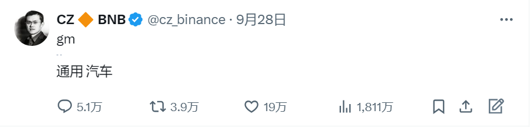
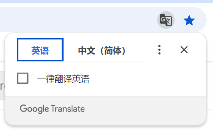
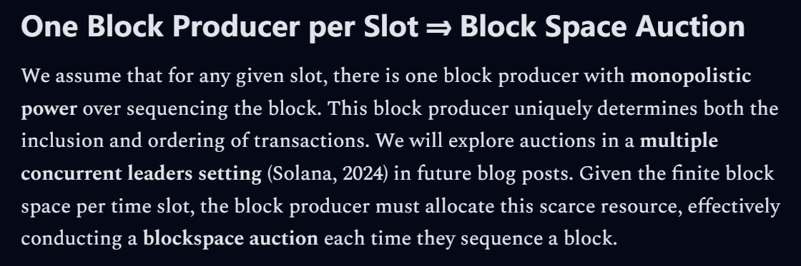
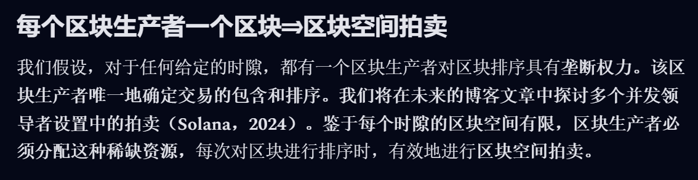
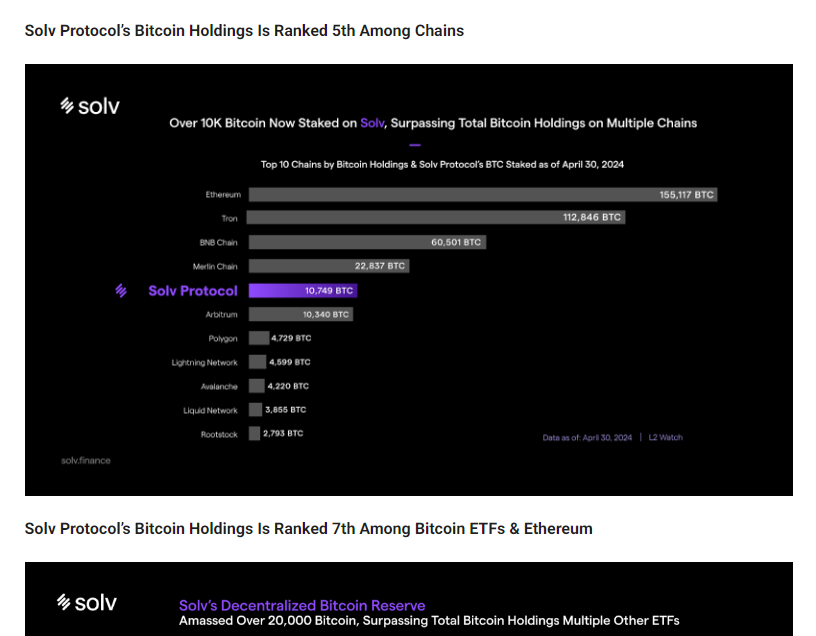

---
layout:
  title:
    visible: true
  description:
    visible: false
  tableOfContents:
    visible: false
  outline:
    visible: false
  pagination:
    visible: false
---

# 关于 DocsZH

2024年9月29日，币安 (全球最大的加密货币交易所) 创始人，前华人首富[CZ](https://x.com/cz\_binance)出狱，此前CZ因洗钱罪被美国联邦法院判处4个月监禁。出狱后，在迪拜的家中，CZ发布了一条[推特](https://x.com/cz\_binance/status/1839861237850497271)，以告诉人们他重获自由。

### 一条推文引发的讨论

#### 从CZ刑满释放的第一条推文说起...

<figure><figcaption></figcaption></figure>

遗憾的是，作为中文流利的华人首富，CZ出狱后的第一条推文并未使用母语，且只有两英文字母：`gm`。

#### `gm`的中文意思？通用汽车？

CZ加入了通用汽车？CZ要向[Musk](https://x.com/elonmuskhttps://x.com/elonmusk) (特斯拉创始人) 发出挑战？CZ要颠覆新能源汽车制造业？那是不是可以叫小鹏汽车，大鹏汽车，敞篷汽车...不对，长鹏汽车！

#### 真相只有一个

上面图片里的翻译结果，由微软翻译提供，它错误地将`gm`识别为通用汽车的缩写 (英语：General Motors，缩写为GM）。然而，喜欢在项目方discord里冲浪的Web3黑奴都知道，`gm`的习惯用法，在中文里是`早安`的意思，即`good morning`的首字母缩写。与之相似的，晚安`good night`可以缩写为`gn`。

#### 从Web3黑奴的e-beggar经历说起...

当你立志成为一名Web3黑奴的时候，深夜打开某项目方的协议交互页。由于不知从何下手，你找到了该项目的使用文档，例如：https://docs.ebeggar.com，映入眼帘的是满屏英文，黑夜给了你黑色的眼睛，你却用它寻找中文。此时，你的浏览器可能会提醒你，要不要将网页翻译为中文。

<figure><figcaption></figcaption></figure>

恭喜，黑夜给了你黑色的眼睛，你用它寻找到了中文。接下来，我们会用一个翻译示例，阐述浏览器的自动翻译有多糟糕。

### 不友好的浏览器自动翻译

这里，以我们最近翻译的来自[aPriori](https://beta.rootdata.com/zh/Projects/detail/aPriori?k=OTUwMg%3D%3D)的技术博客为例，此处为博客节选的原文链接：[段落原文](https://0xapr.substack.com/p/unlocking-monads-potential-the-critical?open=false#%C2%A7one-block-producer-per-slot-block-space-auction)

**英文原文：**

<figure><figcaption></figcaption></figure>

**谷歌自动翻译结果：**

<figure><figcaption></figcaption></figure>

在谷歌自动翻译的结果中，任何人都能察觉到显而易见的错误，例如：

* `One Block Producer per Slot ＞ 每个区块生产者一个区块` 语义不通，这是一个病句。

在谷歌自动翻译的结果中，总会有一般人无法理解的内容，例如：

* `slot ＞ 时隙` 时隙是什么意思？

在谷歌自动翻译的结果中，总会有专业术语被错误翻译，但一般人无法察觉，例如：

* `inclusion ＞ 包含` 在区块链技术原语中，`包含`翻译为 `(区块) 打包`，更符合语境。

### DocsZH 存在的意义和价值

#### 我们尝试优化自动翻译结果

在上述博客节选翻译中，我们改正了错误的病句，对专业术语附注了名词解释，并对语义错误的单词译文进行了符合技术语境的演化。以下是我们的最终译文：

> #### 每个时隙 (Slot) 对应一个区块生产者 ⇒ 区块空间拍卖 
>
> 我们假设，对于任何给定的 [Slot](https://ethereum.org/zh/glossary/#slot)，都有一个区块生产者，对区块排序拥有垄断权力，该区块生产者唯一决定交易的打包和排序，我们将在未来的博文中探讨多个并发领导人设置 ([Solana. 2024](https://docs.google.com/document/d/1zSkhW\_Urp2RbTp\_hKGCefc8o895eCczm5fS1RqzTVVE/edit#heading=h.73njnkwdob7a)) 中的拍卖。鉴于每个 Slot 的区块空间有限，区块生产者必须分配这种稀缺资源，每次对区块排序时，都必须有效地进行区块空间拍卖。

#### 改正自动翻译中出现的病句

在上述博客节选的谷歌自动翻译中，`One Block Producer per Slot`被翻译为`每个区块生产者一个区块`，造成这种错误的原因是谷歌翻译无法理解区块链的技术原语。以[以太坊](https://ethereum.org/zh/learn/)为例，[时隙](https://ethereum.org/zh/glossary/#slot) (Slot) 是一种时间单位，用于确定网络中[区块提议](https://ethereum.org/zh/developers/docs/consensus-mechanisms/pos/block-proposal/)的频率，设计目的是让[验证者](https://ethereum.org/zh/glossary/#validator)有机会提议新区块。在以太坊中，每12秒为一个时隙，验证者可以在每个时隙中提议区块。

在翻译之前，我们已经对技术原语有足够了解，对于`One Block Producer per Slot`，我们知道作者想说明的是：在排除空时隙的情况下，每个时隙都会有一个验证者提议、打包区块。因此可以将其翻译为：`每个时隙 (Slot) 对应一个区块生产者`。

#### 对专业术语附注解释

在上述博客节选的翻译中，我们保留了`时隙`对应的英文单词`Slot`，并为其添加了名词解释超链接。读者可以通过链接阅读以太坊基金会关于`时隙`解释的中文文档，详细了解`时隙`的名词解释及技术原语。这么做的好处，读者会对`Slot`的名词概念和相关技术原语保留印象，再次看到涉及该名词的内容，阅读会轻松得多。

#### 演化不符合技术语境的单词语义

在上述博客节选的谷歌自动翻译中，`inclusion`被翻译为`包含`，这看起来并没有什么错误，`inclusion`的普遍用法即为`包含`。正因为我们对区块链技术原语的了解，我们知道，此处的`inclusion`指的是打包 (区块)，意为将用户的交易打包进某个区块中，以形成链上区块。因此，应将`inclusion`翻译为`打包`。

#### 消除可能存在的歧义隐患

我们需要更换一个翻译示例，接下来，以我们最近翻译的Solv Protocol Documentation中的两张图片的标题为例，此处为标题的原文链接：[段落原文](https://docs.solv.finance/solv-documentation/getting-started/the-state-of-bitcoin#proven-demand)

**英文原文：**

<figure><figcaption></figcaption></figure>

**ChatGPT GPT-4o 翻译结果：**

<figure><figcaption></figcaption></figure>

**DeepL Pro 翻译结果：**

<figure><figcaption></figcaption></figure>

无可争议的是，GPT-4o和DeepL Pro是目前除人工翻译外，最优秀的翻译工具。对于上述示例，这两款工具的翻译结果毫无差别，但只有我们自己知道，`Solv Protocol’s Bitcoin Holdings Is Ranked 5th Among Chains`翻译为`Solv协议的比特币持有量在区块链中排名第五`并不合适。

因为如果将`Holdings`翻译为其最常用的含义：`持有量`，可能会被协议用户错误理解——我的比特币怎么变成协议持有了，这是否存在隐患。

因此，在此处，我们演化了`Holdings`的原本含义，将其翻译为`存款量`。

我们试图将这句话翻译为：`Solv协议的比特币存款量在区块链中排名第五`，该翻译结果很好的消除了可能会产生的用户误会，阐明了Solv协议中的比特币资产是用户的存款，而不是被协议私自持有，不会被挪作他用。

但是，上述翻译结果我们并不满意，因为其并没有在感官上刺激到读者，引导读者阅读图片信息。

#### 对文档结构做出合理优化

在上述图片标题翻译中，我们根据上下文，揣摩作者试图向读者传达的实际信息，对文档结构做出优化。最终结果如下：

**原文标题 1：**

Solv Protocol’s Bitcoin Holdings Is Ranked 5th Among Chains

我们的翻译结果：

与L1 / ETH L2 / BTC L2比较：Solv的$BTC存款量位列第五

**原文标题 2：**

Solv Protocol’s Bitcoin Holdings Is Ranked 7th Among Bitcoin ETFs & Ethereum

我们的翻译结果：

与BTC ETFs / Ethereum比较：Solv的$BTC存款量位列第七

通过阅读原文上下文，我们了解到作者试图向读者强调Solv的比特币存款量排名很靠前这个事实，但没有通过文字具体阐述，而是使用了两张对比图。因此，我们我们使用了 “XXX: XXXXXX” 的结构，在标题里简明扼要的表述了图片试图说明的信息，以帮助读者提前理解图片信息，以引导读者阅读图片。

### 上强度：我要阐述价值观了

正如DocsZH slogan所说，我们致力于前沿区块链技术文档的中文本地化，这显然是一个又脏又累的活。但在Crypto层林世界里，华人一度占据主导地位，从川西的水电站到被称为“三大”的交易所，从华人首富CZ到联合国特权代表Justin Sun，从古典派的ICOer到流行派的e-beggar，以中文为母语的Crypto猎人生生不息。

在ICO的荒蛮时代，Crypto层林里的古典猎人并不需要过多的用户教育，只有简单的“可以转币了”。随着行业的发展和迭代，生存越来越依赖于对行业的深度了解，项目迭代成协议，打币迭代成DeFi。每一年甚至于每个月，都有不同的行业叙事，Layer、Restaking，Ordinals等等。

受限于语言环境和区块链专业的技术原语，中文用户试图了解某个协议的技术路径，未来路线，参与方式等信息是有阻碍的，自动中文翻译并不能很友好的将内容还原成协议想表达的真实意图，如同`gm`和`早安`。这可能对中文Crypto猎人造成安全隐患，甚至蒙受损失，例如：将资产质押进了DeFi，却无法自主的完成赎回操作；将资产铸造成了某种稳定币，却不了解存在价格脱锚。

这些并非不可避免，几乎所有协议都会在文档或博客里详细说明和解释，内容包括但不限于：协议技术介绍，协议资产介绍，DApp功能介绍，DApp操作流程，操作风险说明等。因此，只需要将协议文档或博客翻译为中文，相信大部分中文区Crypto猎人都会主动去了解所参与的协议，这关系着个人的资产安全。

**以上，也是DocsZH的价值所在。**

### 下强度：e-beggar，换种方式做Web3黑奴吧

长话短说，缺贡献者，召唤e-beggar，加入我们！

#### **勾搭方式**

* 推特私信，我的推特：[@Scaling\_News](https://x.com/Scaling\_News)

#### **贡献者要求**

* 能延迟满足，劳而无获不搞对立，这是e-beggar常态，所以丑话说在前头。
* 能主动学习，快速掌握ChatGPT, Notion, DeepL, Gitbook等工具的熟练使用。

#### **按劳分配**

* DocsZH会力所能及的申请一些具有潜在回报的社区贡献计划，采用proof-of-work进行贡献分配。

#### **初步分配方案：**

1. **Scaling News Treasury - 30%**

* Managed by multi-signature account, transfer requires creating a proposal.
* Used to pay for ChatGPT Plus, Notion Plus, DeepL Ultimate, Gitbook Enterprise, domain, and other expenses, the team relies on these tools for collaboration.

2. **Core Contributors & Advisors - 30%**

* 20% is available on day 1 and the rest is vested over 12 months.
* They are always with Scaling News, dedicated to solving the toughest problems.

3. **General Contributors - 40%**

* Adopting proof-of-work mechanism, distribution by contribution output.
* We offer incentives in exchange for contributors joining. They may not be long-term companions, but they are indeed important partners.

最后的**分配方案**是不是像极了项目方的TGE文档，给你一种马上就可以claim的错觉。

非也，论e-beggar的自我养成，勾搭我之前，请将**初步分配方案**翻译为简体中文，DM给我。

**Da Da Da... Let's have fun together... by Chin.**

