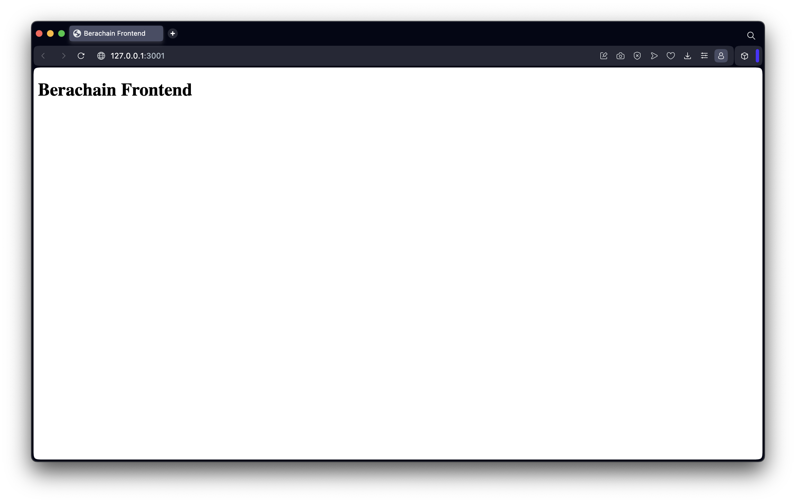
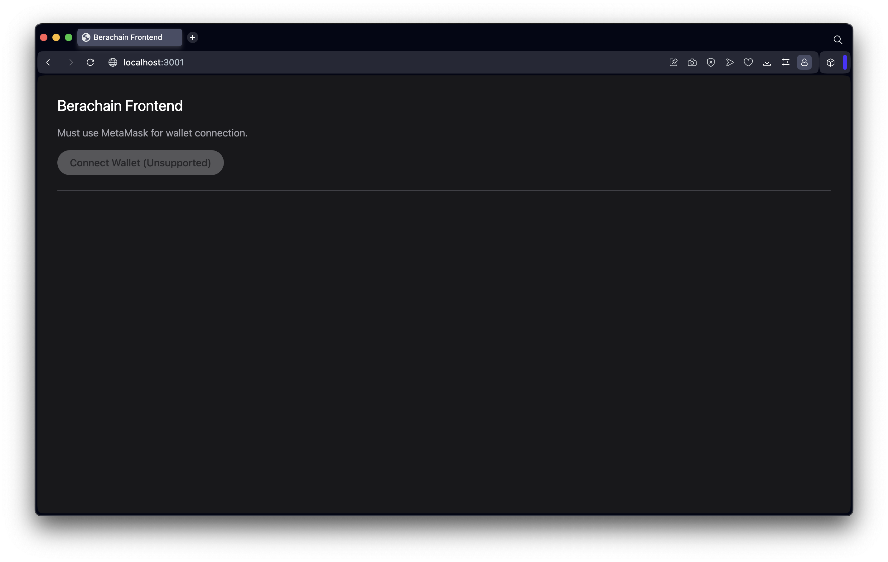
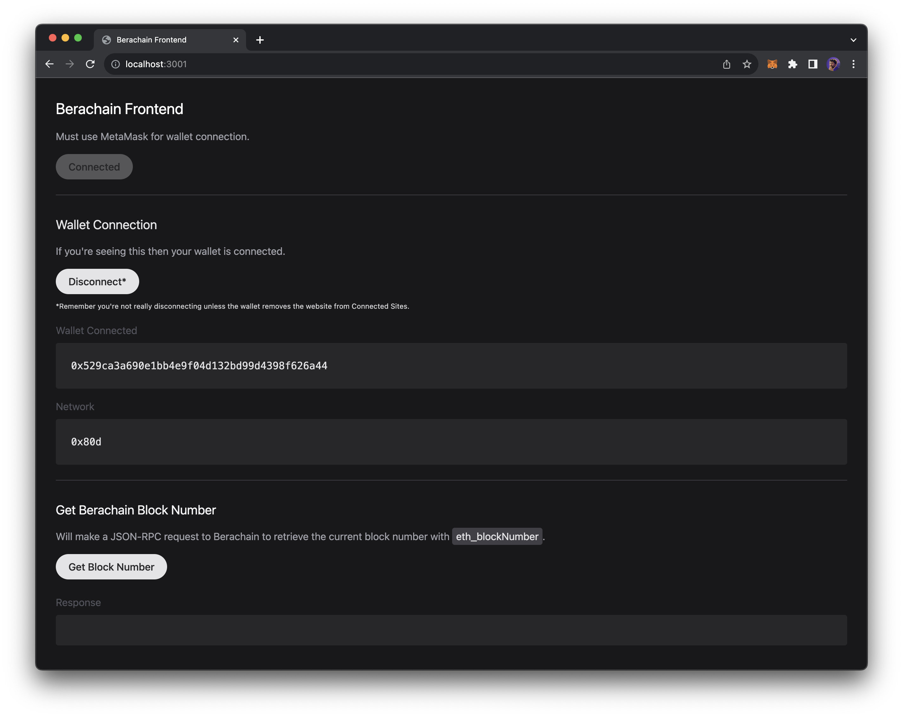
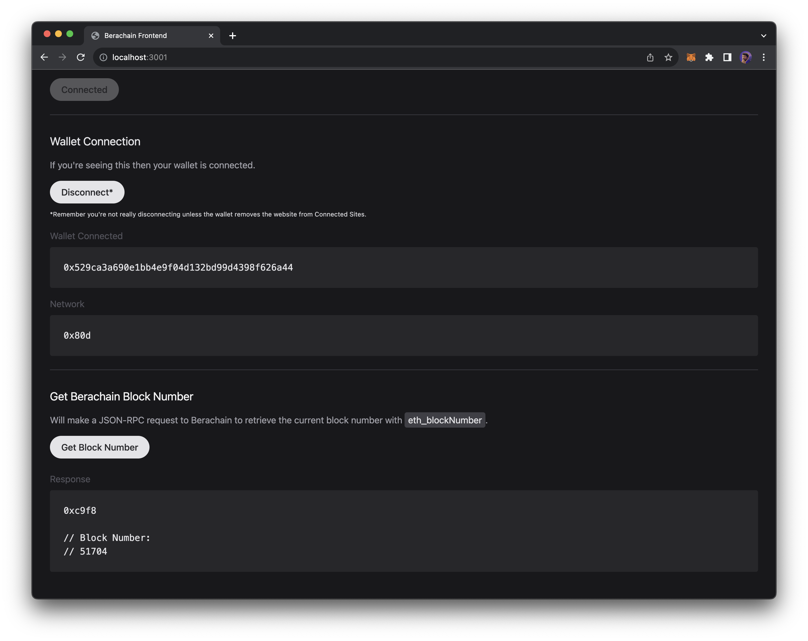

# 前端和 UI 部署

本节将展示如何构建一个前端，使其能够连接钱包并向Berachain发送RPC请求，以获取由[JSON-RPC endpoints](https://geth.ethereum.org/docs/interacting-with-geth/rpc)规范的当前测试网区块号。

首先，请检查你的浏览器钱包配置是否正确，并通过[BEX](https://bartio.bex.berachain.com/)能否顺利连接到Berachain测试网。

本节目标是使用Vanilla JavaScript与Berachain进行交互，以理解JSON-RPC请求的基本知识。

### 先决条件

开始之前，请确保你的本地设备上满足以下条件：

* VSCode IDE（推荐）
* NVM, Node,  `v18.18.2`（三选一）
* `pnpm`, `yarn`, `npm`（三选一）

### 代码设置 <a href="#code-setup" id="code-setup"></a>

创建文件夹：

```bash
mkdir frontend-berachain;
cd frontend-berachain;
```

实例化依赖项，用于启动一个HTTP服务器，在网页中查看HTML和JavaScript。

```bash
# FROM: ./frontend-berachain;

pnpm init;

# [Expected Output]:
# {
#   "name": "frontend-berachain",
#   "version": "1.0.0",
#   "description": "",
#   "main": "index.js",
#   "scripts": {
#     "test": "echo \"Error: no test specified\" && exit 1"
#   },
#   "keywords": [],
#   "author": "",
#   "license": "ISC"
# }
```

安装依赖项，用于实时刷新页面并创建一个新的HTTP服务器。

```bash
# FROM: ./frontend-berachain;

pnpm add -D live-server;
```

创建一个名为`app`的新文件夹，并在该文件夹中创建两个文件：`index.html`和`scripts.js` 。

```bash
# FROM: ./frontend-berachain;

mkdir app;
touch app/index.html;
touch app/scripts.js;
echo "node_modules" > .gitignore;
git init;
```

修改`index.html`文件。

**文件位置**：`./app/index.html`，运行以下代码：

```bash
<!DOCTYPE html>
<html lang="en">
  <head>
    <meta charset="UTF-8" />
    <meta name="viewport" content="width=device-width, initial-scale=1.0" />
    <title>Berachain Frontend</title>
  </head>
  <body>
    <h1>Berachain Frontend</h1>
  </body>
</html>
```

通过向`package.json`添加 run 命令来查看更改。

**文件位置**：`./package.json`，运行以下代码：

```bash
{
  "name": "frontend-berachain",
  "version": "1.0.0",
  "description": "",
  "main": "index.js",
  "scripts": {
    "dev": "./node_modules/.bin/live-server --port=3001 --watch=app --mount=/:./app",
    "test": "echo \"Error: no test specified\" && exit 1"
  },
  "keywords": [],
  "author": "",
  "license": "ISC",
  "devDependencies": {
    "live-server": "^1.2.2"
  }
}
```

运行以下代码启动服务器：

```bash
# FROM: ./frontend-berachain;

pnpm dev;

# [Expected Output]:
# Mapping / to "/path/to/frontend-berachain/app"
# Serving "/path/to/frontend-berachain" at http://127.0.0.1:3001
# Ready for changes
```

如下所示，服务器启动成功：

<figure><figcaption></figcaption></figure>

### 创建前端UI

方便起见，可以参考CDN中的[Tailwind](https://tailwindcss.com/)采用Tailwind HTML的classes。

通过添加一个指向Tailwind CDN `<script>`的标签文件和一个本地`scripts.js`文件，来修改`index.html`文件。


下方操作是可选项，会使整个前端页面更好看，直男可忽略。


**文件位置**：`./app/index.html`，运行以下代码：

```bash
<!DOCTYPE html>
<html lang="en">
  <head>
    <meta charset="UTF-8" />
    <meta name="viewport" content="width=device-width, initial-scale=1.0" />
    <script src="https://cdn.tailwindcss.com"></script>
    <script src="scripts.js"></script>
    <title>Berachain Frontend</title>
  </head>
  <body class="bg-zinc-900 pt-24 lg:pt-0">
    <main class="p-8">
      <h1 class="text-2xl text-white mb-4">Berachain Frontend</h1>

      <p class="text-zinc-400 mb-4">Must use MetaMask for wallet connection.</p>

      <!-- START: Main interaction to connect our wallet -->
      <div class="mb-6">
        <button
          type="button"
          disabled
          id="button-connect"
          class="h-10 bg-zinc-200 text-zinc-800 px-5 rounded-full font-medium disabled:bg-opacity-30"
        >
          Connect Wallet (Unsupported)
        </button>
        <div
          id="div-error-connect"
          class="mt-4 bg-red-300 rounded p-6 text-red-800 hidden"
        ></div>
      </div>
      <!-- END -->

      <hr class="border-zinc-700 mb-8" />

      <!-- START: Main section that will appear when our wallet is connected -->
      <section id="section-connected" class="hidden">
        <h2 id="wallet-connection" class="text-xl text-zinc-200 mb-4">
          Wallet Connection
        </h2>

        <p class="text-zinc-400 mb-4">
          If you're seeing this then your wallet is connected.
        </p>

        <div class="mb-4">
          <button
            type="button"
            id="button-disconnect"
            class="h-10 mb-2 bg-zinc-200 text-zinc-800 px-5 rounded-full font-medium disabled:bg-opacity-30"
          >
            Disconnect*
          </button>
          <p class="text-sm text-zinc-300">
            <small
              >*Remember you're not really disconnecting unless the wallet
              removes the website from Connected Sites.</small
            >
          </p>
        </div>
        <div class="mb-4">
          <label class="block mb-2 text-zinc-600">Wallet Connected</label>
          <code class="block bg-zinc-500 p-6 rounded bg-zinc-800 text-zinc-200">
            <pre id="pre-wallet-address"></pre>
          </code>
        </div>
        <div class="mb-6">
          <label class="block mb-2 text-zinc-600">Network</label>
          <code class="block bg-zinc-500 p-6 rounded bg-zinc-800 text-zinc-200">
            <pre id="pre-wallet-network"></pre>
          </code>
        </div>

        <hr class="border-zinc-700 mb-8" />

        <h2 id="eth-blocknumber" class="text-xl text-zinc-100 mb-4">
          Get Berachain Block Number
        </h2>

        <p class="text-zinc-400 mb-4">
          Will make a JSON-RPC request to Berachain to retrieve the current
          block number with
          <span class="bg-zinc-700 text-zinc-200 py-1 px-1.5 rounded"
            >eth_blockNumber</span
          >.
        </p>

        <form id="form-eth-blocknumber">
          <div class="mb-4">
            <button
              type="submit"
              class="h-10 mb-2 bg-zinc-200 text-zinc-800 px-5 rounded-full font-medium disabled:bg-opacity-30"
            >
              Get Block Number
            </button>
          </div>

          <!-- Where the results are displayed -->
          <div class="mb-4">
            <label class="block mb-2 text-zinc-600">Response</label>
            <code
              class="block bg-zinc-500 p-6 rounded bg-zinc-800 text-zinc-200"
            >
              <pre id="pre-eth-blocknumber"></pre>
            </code>
          </div>
        </form>
      </section>
      <!-- END -->
    </main>
  </body>
</html>
```

如下所示，UI美化成功：

<figure><figcaption></figcaption></figure>

### 添加JavaScript <a href="#javascript-functionality" id="javascript-functionality"></a>

设置好HTML结构，现在添加允许将钱包连接到浏览器的JavaScript功能。这一步需要使用相当多的代码，请仔细查看注释以便了解所有功能。

**文件位置**：`./app/scripts.js`，运行以下代码：

```bash
// Main Function
// ========================================================
/**
 * Main wallet connection interaction
 */
const connect = async () => {
  console.group("connect");

  // Hide errors when trying to connect
  const devErrorConnect = document.getElementById("div-error-connect");
  devErrorConnect.innerHTML = "";
  devErrorConnect.classList = devErrorConnect.classList.value.includes("hidden")
    ? devErrorConnect.classList.value
    : `${devErrorConnect.classList.value} hidden`;

  // Attempt to connect to wallet with JSON-RPC request
  try {
    const accounts = await window.ethereum.request({
      method: "eth_requestAccounts",
    });
    const chainId = await ethereum.request({ method: "eth_chainId" });

    // Disable connect button
    const buttonConnect = document.getElementById("button-connect");
    buttonConnect.setAttribute("disabled", true);
    buttonConnect.innerHTML = "Connected";

    // Show connected section
    const sectionConnected = document.getElementById("section-connected");
    sectionConnected.classList = "";

    // Display wallet connected
    const preWalletAddress = document.getElementById("pre-wallet-address");
    preWalletAddress.innerHTML = accounts[0];

    // Display current network connected
    const preWalletNetwork = document.getElementById("pre-wallet-network");
    preWalletNetwork.innerHTML = `${chainId}`;
  } catch (error) {
    console.log({ error });
    devErrorConnect.innerHTML =
      error?.message ?? "Unknown wallet connection error.";
    devErrorConnect.classList = devErrorConnect.classList.value.replaceAll(
      "hidden",
      ""
    );
  }
  console.groupEnd();
};

/**
 * Main function that disconnects from the browser
 */
const disconnect = () => {
  console.group("disconnect");

  // Hide connected section
  const sectionConnected = document.getElementById("section-connected");
  sectionConnected.classList = "hidden";

  // Enabled connect button
  const buttonConnect = document.getElementById("button-connect");
  buttonConnect.removeAttribute("disabled");
  buttonConnect.innerHTML = "Connect Wallet";

  console.groupEnd();
};

/**
 * Main function that handles the form request for a read JSON-RPC request
 * @param {*} event
 */
const onSubmitEthBlockNumber = async (event) => {
  event.preventDefault();
  console.group("onSubmitEthBlockNumber");

  // Reset & Set Loading State
  const preEthBlockNumber = document.getElementById("pre-eth-blocknumber");
  const button = document.querySelector(`#${event.currentTarget.id} button`);
  button.setAttribute("disabled", true);
  button.innerHTML = `${button.innerHTML} (Loading...)`;

  // Attempt request for block number
  try {
    const result = await window.ethereum.request({
      method: "eth_blockNumber",
    });

    console.log({ result });

    preEthBlockNumber.innerHTML = `${result}\n\n// Block Number:\n// ${parseInt(
      result,
      16
    )}`;
  } catch (error) {
    console.log({ error });
    preEthBlockNumber.innerHTML = error?.message ?? "Unknown JSON-RPC error.";
  }

  button.removeAttribute("disabled");
  button.innerHTML = "Get Block Number";
};

// Initial Script Loaded On Window Loaded
// ========================================================
/**
 * Init
 */
window.onload = async () => {
  console.log("WINDOW ONLOAD!");

  // Get All Elements
  const buttonConnect = document.getElementById("button-connect");
  const buttonDisconnect = document.getElementById("button-disconnect");
  const formEthBlockNumber = document.getElementById("form-eth-blocknumber");

  // Add Interactions
  buttonConnect.addEventListener("click", connect);
  buttonDisconnect.addEventListener("click", disconnect);
  formEthBlockNumber.addEventListener("submit", onSubmitEthBlockNumber);

  // Check if browser has wallet integration
  if (typeof window?.ethereum !== "undefined") {
    // Activate elements
    buttonConnect.removeAttribute("disabled");
    buttonConnect.innerHTML = "Connect Wallet";
  }
};
```

现在，如果连接到安装了MetaMask钱包的浏览器，且你的钱包已设置为Berachain测试网，便可以看到如图所示的交互信息。另外，你可以连接到该站点以查看当前钱包地址和正在使用的链 ID。

<figure><figcaption></figcaption></figure>

现在，你可以通过前端UI，提交表单执行RPC请求，并可以看到显示的结果。

<figure><figcaption></figcaption></figure>

### 后续步骤 <a href="#next-steps" id="next-steps"></a>

有很多库和框架(libraries/frameworks)可以帮助开发者快速构建dApp，例如React、NextJS、Svelte、Wagmi、Ethers、Viem、WalletConnect和RainbowKit等。请参阅[开发者工具](../for-developers/developer-tools.md)以了解更多。

现在，你已经掌握了如何通过前端与Berachain进行交互，请查看[开发者指南](../developer-guides/)，学习构建合约或其他前端应用程序。
