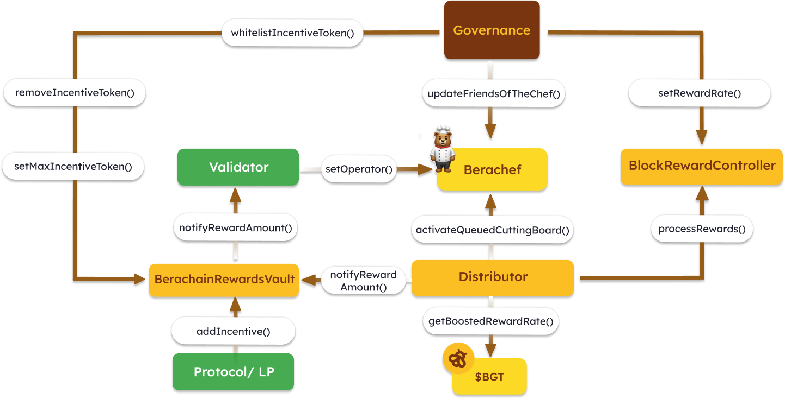

# 流动性证明架构

<figure><figcaption>
此图概述了流动性证明（PoL）关键合约之间的相互作用
</figcaption></figure>

### BeraChef.sol[​](https://docs.berachain.com/developers/#berachef-sol)

BeraChef合约负责存储验证者的偏好，以便将`$BGT`分配到奖励金库。

#### 关键术语

* **Cutting Board**：每个验证者都有自己的Cutting Board，用于存储他们对奖励金库的偏好和权重。当验证者被选中提议区块时，`$BGT`将分配到这些奖励金库。
* **Friends Of The Chef**：这些地址在验证者Cutting Board名单中有一席之地。换句话说，这是白名单[奖励金库](../../learn/proof-of-liquidity/rewardvaults.md)的合集。

#### 关键函数

`queueNewCuttingBoard`：此函数允许验证者设置未来区块的Cutting Board分配，此函数只能由验证者调用。

`activateQueuedCuttingBoard`：此函数由`Distributor`合约在验证者被选中提议区块时调用，并被激活。

`getActiveCuttingBoard` / `getQueuedCuttingBoard`：这些函数用于return既定验证者（被选中提议区块）活跃/队列中的cutting board数据。

`updateFriendsOfTheChef`：此函数用于更新`$BGT`接收者/奖励金库是否被列入白名单的状态。此函数只能由治理模块调用，这就是为什么需要治理提案来将新的奖励金库列入白名单，或对现有奖励金库进行更改。

### Distributor.sol[​](https://docs.berachain.com/developers/#distributor-sol)

Distributor合约负责分配来自奖励控制器的区块奖励。每个代币库都有自己的Cutting Board，如果不存在，则使用默认Cutting Board。如果治理(Governance)没有设置默认Cutting Board，则不会铸造和分发奖励。

#### 关键函数[​](https://docs.berachain.com/developers/#key-functions-1)

`distributeFor`：用于向既定验证者（被选中提议区块）的Cutting Board中列出的奖励金库分发`$BGT`奖励。证明者(Prover)的作用是证明既定验证者确实向`Distributor`合约提交了指定区块，以便相应地分发奖励。

### BerachainRewardsVault.sol[​](https://docs.berachain.com/developers/#berachainrewardsvault-sol)

俗称奖励金库(Reward Vaults)，奖励金库是一种合约，用户可以在其中质押符合PoL流动性证明要求的资产，以获得`$BGT`奖励。奖励金库还存储协议提供的奖励，在收到`$BGT`后分配给验证者。

#### 关键函数[​](https://docs.berachain.com/developers/#key-functions-2)

`addIncentive`：此函数控制奖励代币`$BGT`的产出，确保以既定的产出率分配`$BGT`发行。奖励代币必须首先通过`whitelistIncentiveToken`治理，列入白名单，并确定该代币的最低奖励率。

`stake`：此函数允许用户质押符合PoL要求的资产，以获得`$BGT`奖励。

`withdraw`：此函数允许用户从奖励金库提取质押资产。

### BGT.sol[​](https://docs.berachain.com/developers/#bgt-sol)

BGT合约负责处理与`$BGT`相关的所有事务，由治理模块控制，`$BGT`只能由`BlockRewardController`合约铸造。

#### 关键术语

* **Boosts**：`$BGT`持有人可以通过Boosts提高验证者出块奖励，从而验证者在提议区块后可以获得更多`$BGT`奖励。助力(boosts)也称为“委托”，`$BGT`持有人可以将boosts应用于多个验证者。
* **Sender Whitelist**：`$BGT`不可转让，只能向白名单地址发送（例如`$BGT` -> `$BERA`销毁器合约）。这是为了确保`$BGT`只分配给PoL参与者。

#### 关键函数[​](https://docs.berachain.com/developers/#key-functions-3)

`queueBoost`：此函数允许`$BGT`持有者帮助验证者加入Boosts队列，此函数只能由`$BGT`持有人调用。

`activateBoost`：此函数用于激活既定验证者的所有队列和Boosts，同一验证者的Boosts激活间隔时间是`8191`个区块，这是为了避免过度重新授权。

### BlockRewardController.sol[​](https://docs.berachain.com/developers/#blockrewardcontroller-sol)

BlockRewardController合约的主要功能是管理`$BGT`(Bera Governance Token)的奖励率，并处理`$BGT`奖励的铸造和分配。

#### 关键函数[​](https://docs.berachain.com/developers/#key-functions-4)

`processRewards`：此函数负责处理既定区块的奖励计算和分配。它根据基本费率、奖励费率以及验证者获得的Boosts来计算奖励，然后铸造并分配相应数量的`$BGT`代币。此函数由`Distributor`合约调用。
