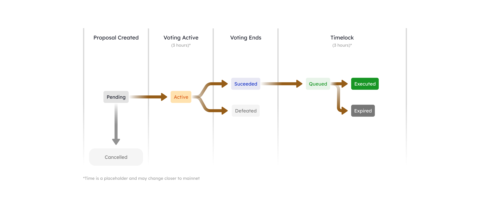

# 治理模型概述

Berachain在治理中采用`$BGT`，允许`$BGT`持有人对PoL系统和核心dApps的关键功能提供重要的决策表决。以下是治理中的一些示例：

* PoL合规资产白名单（例如，新的抵押资产、激励资产）
* `$HONEY`铸造参数（例如，符合条件的抵押资产、铸造率）
* 原生dApps治理（例如，Bend利率模型的迭代）
  * Berps
  * Bend
  * Bex
* 白名单奖励金库的`$BGT`分配

### 治理流程[​](https://docs.berachain.com/learn/governance/#governance-process)

Berachain的治理流程分为以下阶段：

1. **创建提案**：任何满足投票权数量要求的用户都可以创建治理提案。
2. **提案待定**：提案创建后，进入等待期，然后才能进行投票。
3. **提案投票**：在投票期间，`$BGT`持有人进行提案投票。
4. **投票结果**：投票结束后，投票结果显示为“成功”或“失败”，提案需要达到`$BGT`法定数才能通过。
5. **提案锁定**：如果提案通过，提案将被锁定，进入待执行队列。
6. **提案执行**：锁定期满，提案将被执行，实施所提议的更改。

<figure><figcaption></figcaption></figure>

### 创建提案[​](https://docs.berachain.com/learn/governance/#creating-a-governance-proposal)

Berachain的治理提案创建分为以下步骤：

1. **拥有足够投票权**：你需要拥有足够的`$BGT`投票权，可以是直接持有`$BGT`或由其他持有人委托。
2. **委托`$BGT`**：将你的`$BGT`委托给自己获得投票权，或由其他持有人委托给你。
3. **撰写提案**：明确说明你希望实施的更改。例如：希望在BeraChef合约中添加奖励金库，你需要列出奖励金库合约地址和函数调用，来更新“friends of the chef”。
4. **提交提案**：使用治理合约在链上提交提案。这需要调用`propose`函数，并附上必要参数。
5. **跟踪提案**：提案提交后，跟踪提案进展。鼓励`$BGT`持有人参与提案讨论，并对提案投票。
6. **提案通过：**如果提案通过且锁定期满，提案将被执行，提议的更改将被实施。

有关创建治理提案的详细演练，包括代码示例和分步说明，请参阅[Berachain Github](https://github.com/berachain/guides/tree/main/apps/berachain-governance-proposal)。

### 测试网治理体系

以下参数标准适用于测试网：


以下参数仅适用于测试网，主网上线时可能会发生变化。务必联系Berachain团队才能将你的提案列入测试网白名单。


| 阶段状态 | 参数标准               |
| ---- | ------------------ |
| 创建提案 | 至少持有1000`$BGT`     |
| 提案待定 | 3小时等待期             |
| 提案投票 | 3小时投票期             |
| 投票结果 | 需要20亿`$BGT`达到通过法定数 |
| 提案锁定 | 3小时锁定期             |
