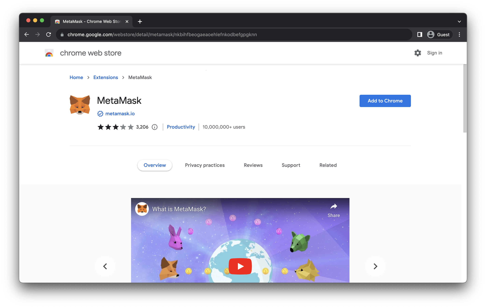
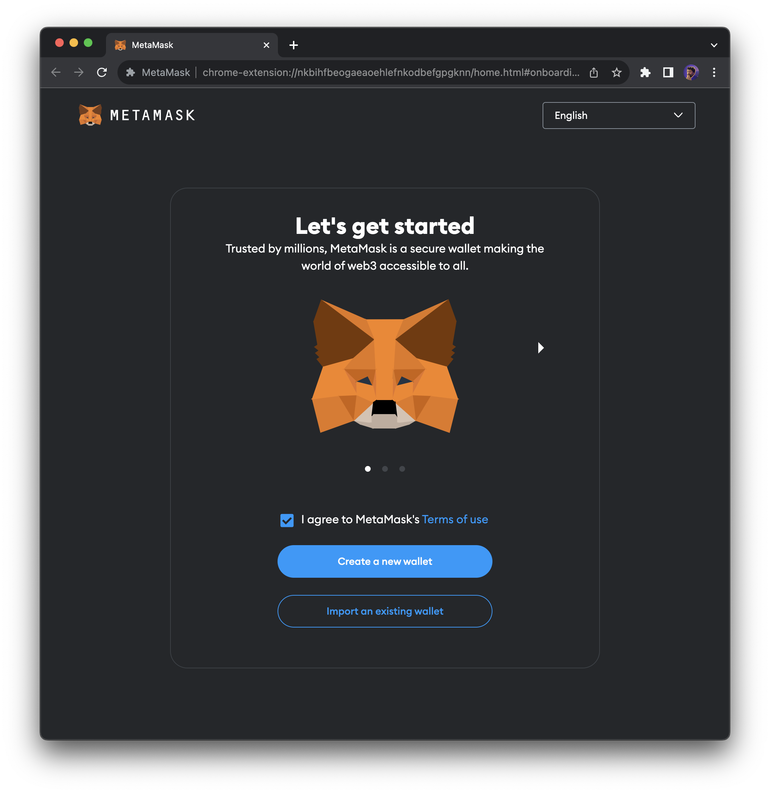
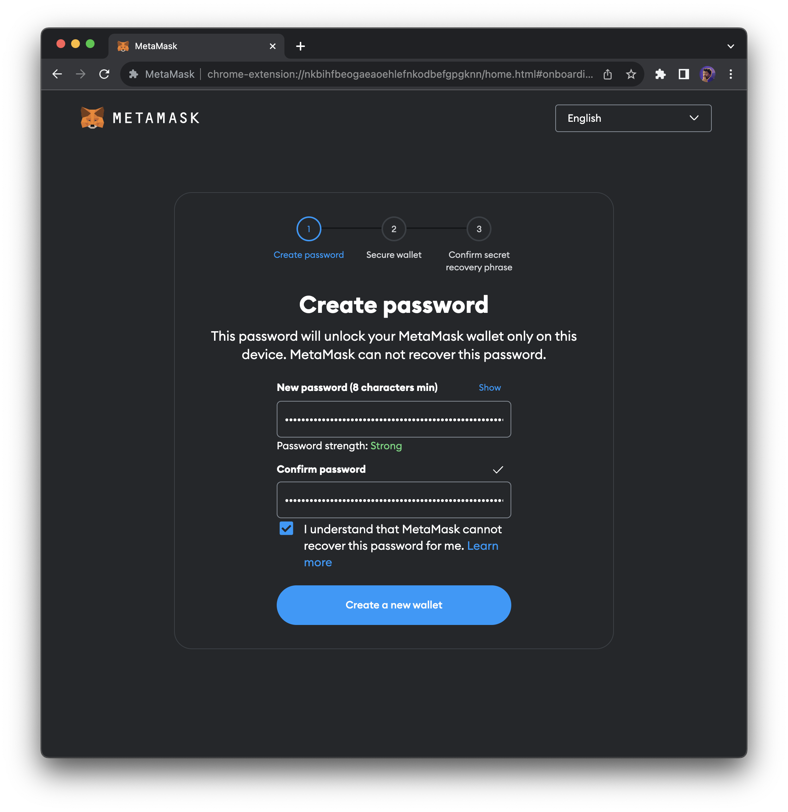
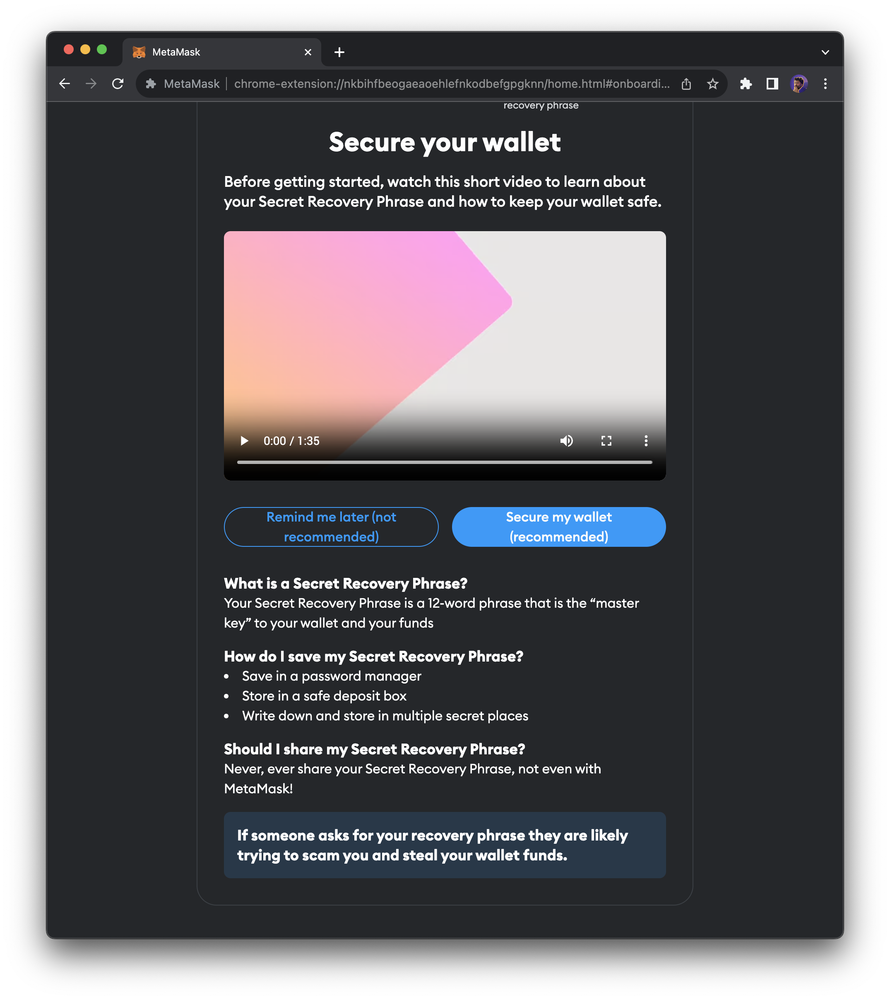
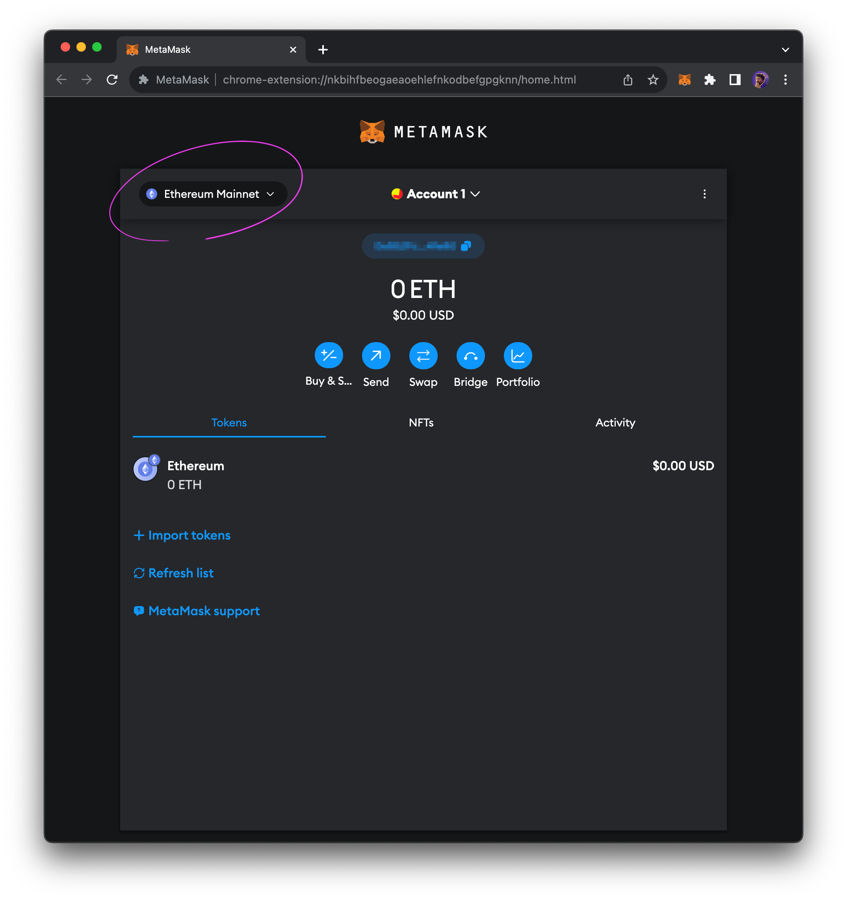
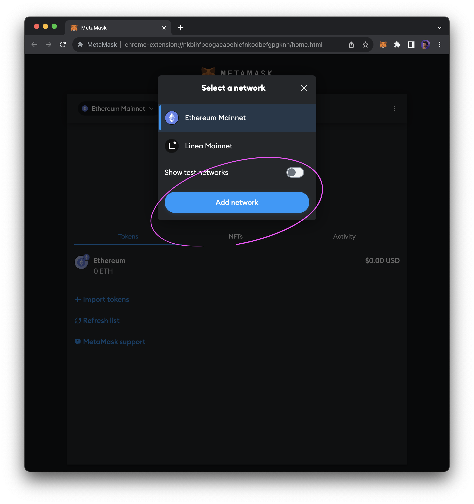
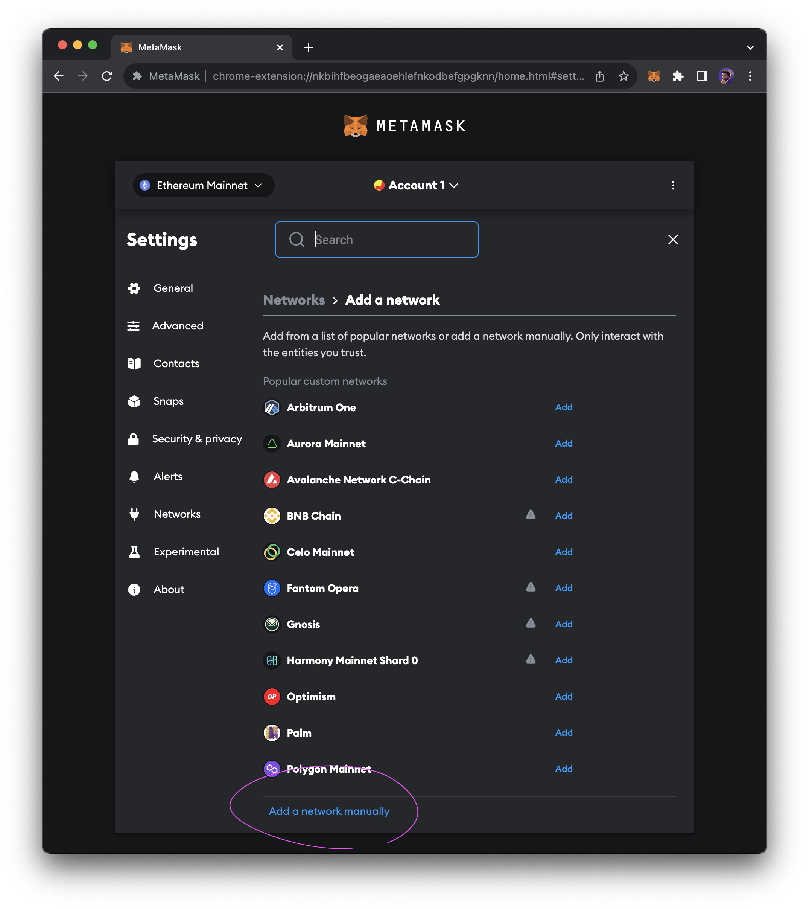
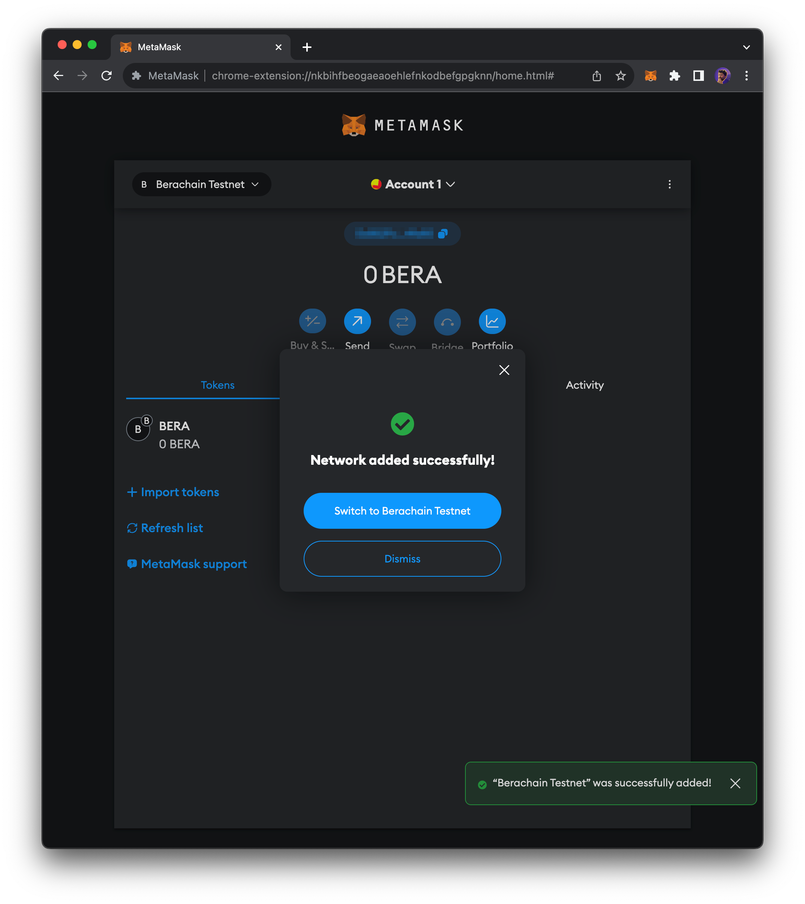

# 连接到 Berachain

区块链钱包允许你，且仅允许你访问你在Berachain上的资产。钱包允许你创建和存储私钥，然后使用私钥来证明你有权访问钱包中的资产，以执行交易代币、购买NFT、玩游戏等操作。

### Berachain bArtio RPC 

将下方信息复制并粘贴到任何支持导入RPC的钱包中。&#x20;

|          |                                                                       |
| -------- | --------------------------------------------------------------------- |
| 网络名称     | Berachain bArtio                                                      |
| RPC 链接   | [https://bartio.rpc.berachain.com](https://bartio.rpc.berachain.com/) |
| 链 ID     | 80084                                                                 |
| Gas 代币符号 | BERA                                                                  |
| 区块浏览器链接  | [https://bartio.beratrail.io](https://bartio.beratrail.io/)           |

**另外，Berachain Docs提供了一键连接，点击此页**[**一键添加网络**](https://docs.berachain.com/developers/network-configurations#add-the-network-in-one-click)**中的**<mark style="background-color:yellow;">**`Add Testnet`**</mark>**按钮即可。**

### 支持的钱包

目前，任何支持 `RPC 导入` 的 [EVM钱包](https://ethereum.org/en/wallets/find-wallet/) 均可配置Berachain网络，如下方所列钱包：

* [MetaMask](https://metamask.io/)
* [Coinbase Wallet](https://www.coinbase.com/wallet)
* [Brave Wallet](https://brave.com/wallet/)
* [Frame](https://frame.sh/)

### 在MetaMask钱包中配置Berachain网络[​](https://docs.berachain.com/learn/connect-to-berachain#how-to-setup-a-metamask-wallet-with-berachain-%F0%9F%A6%8A)

本教程将指引你创建MetaMask钱包并配置Berachain网络。

注意：建议你通过Chrome浏览器进行操作。

#### 第一步：安装MetaMask钱包

点击访问[Metamask](https://metamask.io/)钱包官网，下载适配你使用的浏览器的钱包扩展程序，务必确保扩展程序由`metamask.io`提供。

<figure><figcaption></figcaption></figure>

#### 第二步：在MetaMask中创建钱包[​](https://docs.berachain.com/learn/connect-to-berachain#step-2-create-your-wallet-in-metamask)

MetaMask作为Chrome扩展程序安装完成后，会出现初始化入门提示，中文用户建议在右上角将语言选择为`中文简体`，然后点击`创建新钱包`按钮开始创建。

<figure><figcaption></figcaption></figure>

你首先需要设置一个密码，这是你每次打开MetaMask扩展钱包时需要输入的密码。

<figure><figcaption></figcaption></figure>

接下来，请按照说明备份`钱包助记词短语`。这一步非常重要，因为钱包助记词是用来证明你拥有钱包中资产的唯一凭证。

<figure><figcaption></figcaption></figure>

完成以上步骤，恭喜，你已经成功创建了MetaMask钱包！

#### 第三步：将Berachain网络添加到您的钱包[​](https://docs.berachain.com/learn/connect-to-berachain#add-berachain-network-to-your-wallet-%F0%9F%90%BB)

钱包可以连接到各种区块链网络，MetaMask将以太坊设置为默认区块链网络。为了连接到Berachain，我们需要将网络添加到MetaMask并选择它。

一键添加Berachain网络[​](https://docs.berachain.com/learn/connect-to-berachain#add-berachain-network-in-one-click)

点击链接进入[Berachain Docs](https://docs.berachain.com/learn/connect-to-berachain#add-berachain-network-in-one-click)，然后点击该页面的`Add Testnet`按钮，一键将Berachain网络添加到你的MetaMask钱包。

手动添加Berachain网络

要手动添加网络，请单击MetaMask左上角的下拉菜单。

<figure><figcaption></figcaption></figure>

在出现的弹出窗口中点击`添加网络`。

<figure><figcaption></figcaption></figure>

下拉网络列表到最底部，点击`手动添加网络`。

<figure><figcaption></figcaption></figure>

在MetaMask中输入下方信息，以配置网络并连接到Berachain Testnet，正确输入信息后，点击`保存`。

<figure><figcaption></figcaption></figure>

保存网络配置后，恭喜，你已经连接到Berachain Testnet了！

<figure><figcaption></figcaption></figure>
