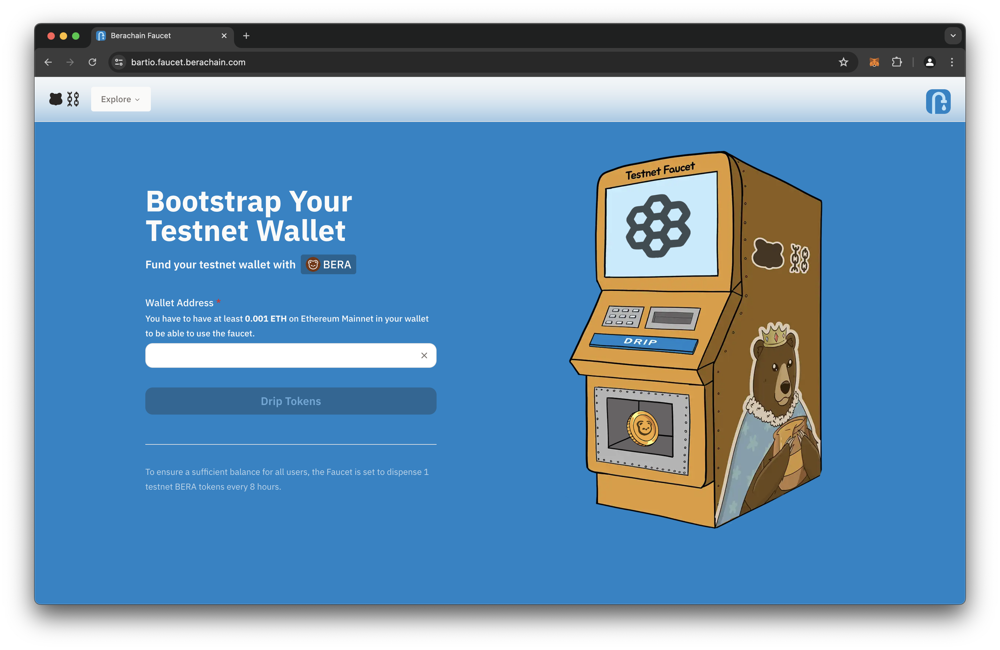
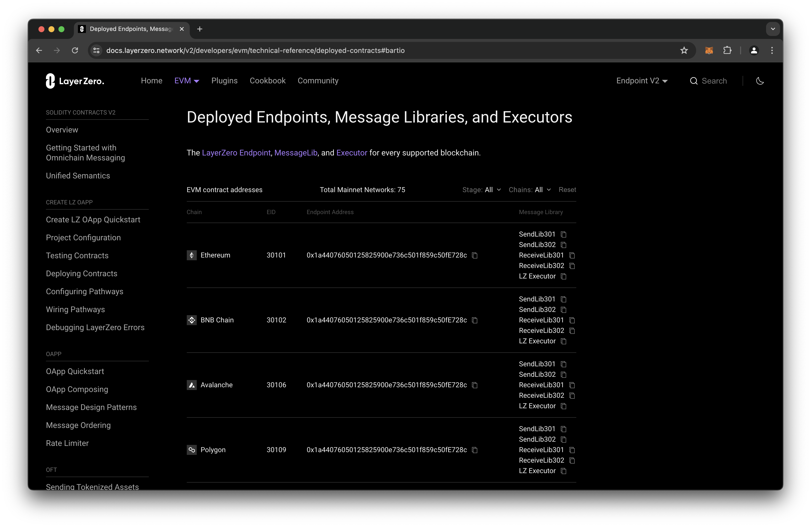

# 如何获得 $BERA

`$BERA`是用于在区块链上发送交易的代币，因此有时也被称为 “gas token” 。它用于支付交易gas费用。

你可以在[$BERA](../proof-of-liquidity/tokens/bera.md)中阅读更多内容。

### 水龙头[​](https://docs.berachain.com/learn/how-to-get-bera#faucet-%F0%9F%92%A7)

水龙头是一种工具，可以让开发者轻松获取Berachain Testnet的`$BERA`测试代币，且无需任何费用。

你可以在[测试网水龙头](../native-dapps/testnet-faucet.md)中阅读更多内容。

<figure><figcaption>
<a href="https://bartio.faucet.berachain.com">https://bartio.faucet.berachain.com</a>
</figcaption></figure>

### 桥接[​](https://docs.berachain.com/learn/how-to-get-bera#bridging-%F0%9F%A4%9D)

桥接服务允许将代币从一个区块链转移到另一个区块链。

#### LayerZero

`$BERA`可以通过LayerZero从以太坊主网和其他链进行桥接。

<figure><figcaption>
<a href="https://docs.layerzero.network/v2/developers/evm/technical-reference/deployed-contracts#bartio">https://docs.layerzero.network/v2/developers/evm/technical-reference/deployed-contracts#bartio</a>
</figcaption></figure>
