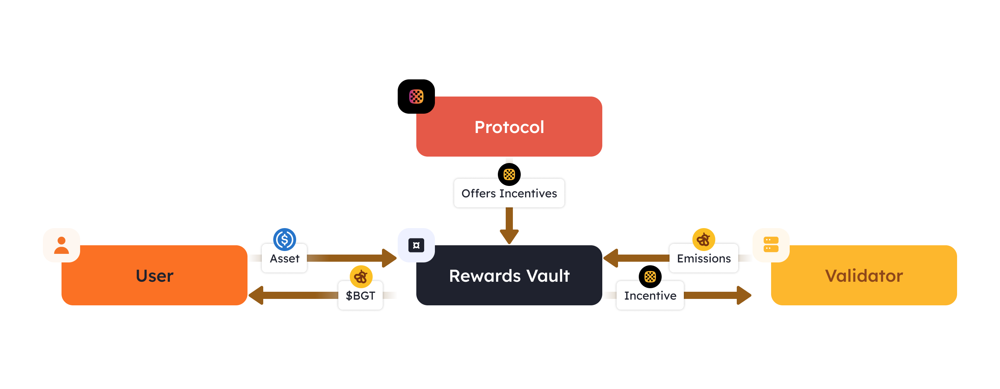

# 激励系统

PoL中的激励措施可以定义为验证者`$BGT`分配的一个创新且可定制的市场。

这是一种简化整个激励系统的途径，验证者可以从奖励金库中选择与其`$BGT`分配动机相符的激励措施，验证者的这些`$BGT`是通过提议区块获得的。

### 激励验证者[​](https://docs.berachain.com/learn/pol/incentives#incentives-for-validators-%F0%9F%92%B0)

`$BGT`分配通过奖励金库派发给流动性提供者。以下是奖励金库的部分流程说明，其中展示了向奖励金库提供激励的协议。

<figure><figcaption></figcaption></figure>

一旦主动验证者产出区块并被奖励`$BGT`，其就可以决定将`$BGT`奖励分配给哪个奖励金库。协议为奖励金库提供的激励，根据每个验证者的`$BGT`质押数额，按比例分配给验证者。


上图仅为了阐述资产进出奖励金库的概念，并非基于金库合约的真实反映。


综上所述，奖励金库中的资产和用户操作流程可以描述如下：

1. 用户将预先选定的资产存入指定的奖励金库。
2. 协议提供激励措施，以吸引将`$BGT`存入其奖励金库。
3. 验证者将`$BGT`奖励存入奖励金库。
4. 协议奖励金库允许用户提取`$BGT`。
5. 协议奖励金库向验证者分配激励收益。

### 激励资产

每个奖励金库最多可以有3个用作激励的资产，以赚取`$BGT`奖励。这也意味着每个奖励金库一次最多可以有3个有效的激励方案。例如：如果用作激励的资产是`$USDC`，该资产只能有唯一的激励方案，直到达到存款上限。

#### 金库激励资产示例[​](https://docs.berachain.com/learn/pol/incentives#reward-vault-incentive-example-%F0%9F%92%A1)

以`$USDC`为例：

```
- User X creates Incentive: 100 `$USDC` for 1 `$BGT` (100:1 Ratio)
- User Y adds 10 `$USDC` Incentive: 110 `$USDC` (100 + 10) for 1.1 `$BGT` (100:1 Ratio)
- Validator Z distributes 1.1 `$BGT` to Reward Vault to fulfill Incentive and receives 110 `$USDC`
- User N create new Incentive: 300 `$USDC` for 1 `$BGT` (300:1 Ratio)
```

### 将激励资产列入白名单[​](https://docs.berachain.com/learn/pol/incentives#how-to-whitelist-incentive-assets-%F0%9F%93%9D)

协议要创建激励方案，需提交提案，仅且提案通过后才能创建。生态协议、用户和基金会根据各自的尽职调查来决定提案是否通过。

激励资产可以作为新的奖励金库提出，也可以作为单独的治理提案进行修改。
