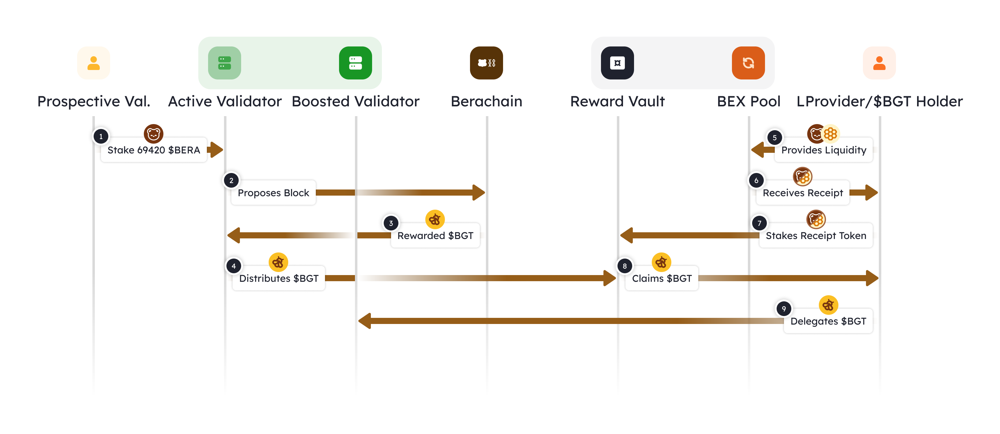

# 流动性证明概述

权益证明的主要缺点之一是缺乏激励不同生态系统的参与者进行合作。验证者几乎没有理由与运行基础设置的协议方和终端用户互动，但他们却获得了大部分经济奖励。另一方面，协议在此基础上启动，为自己保留了大部分代币。

当所有参与者都参与进区块链网络发展时，协议、验证者和链之间就能实现更健康的平衡。

流动性证明PoL涉及链上所有利益相关者的参与和影响。PoL要求不同的利益相关者协同工作，最大限度地提高链上流动性，确保他们获得最大利益。

### 流动性证明生命周期

下图从验证者和委托人的角度展示了流动性证明PoL的生命周期。

<figure><figcaption></figcaption></figure>

1. 潜在验证者（Prospective Val）将提供初始gas代币绑定`$BERA`以保护网络并获得生产区块的资格。所有主动验证者（Active Validator）都有平等的机会被选中提议区块。
2. 随机选择一个主动验证者并提议一个新区块。
3. 为了提议新区块，链会为主动验证者派发治理代币`$BGT`以进行分配。
4. 使用奖励的治理代币，主动验证者将其分发给各种奖励金库，由Berachef合约中的验证者决定不同奖励金库的地址和分配比例。
5. 流动性提供者可以执行流动性操作，例如将某个代币存入BEX池。例如：为流动性池提供`$HONEY`和`$BERA`。
6. 为了提供流动性，流动性提供者会收到一个凭证代币。例如：`$HONEY-WBERA`。
7. 流动性提供者将凭证代币质押在奖励金库中，使他们有资格根据他们的贡献获得`$BGT`。
8. 流动性提供者现在有资格领取分发到奖励金库的`$BGT` ，成为`$BGT`持有者。
9. `$BGT`持有者现在可以将他们的`$BGT`委托给主动验证者，使该验证者成为增强验证者（Boosted Validator），并增加验证者在提议区块时分配的奖励。

### 协调协议方和验证者

由于验证者负责将治理代币分发给奖励金库，当被选中提议一个区块时，它会创造一种新的活力，其中奖励基本上与生态协议方共享。

验证者将与协议建立更牢固的关系，因为他们的奖励权重由委托给他们的治理代币决定，从而建立共生关系。

协议方还可以通过提供激励，引导验证者将其`$BGT`奖励存放在自己的协议金库。

### 现有奖励金库实施情况

以下是现有奖励金库的实施情况：

1. [BEX ](../native-dapps/bex.md)- 特定的BEX流动性池
2. [Berps ](../native-dapps/berps.md)- 将`$HONEY`放入Berps Honey金库
3. [Bend ](../native-dapps/bend.md)- 借用`$HONEY`
