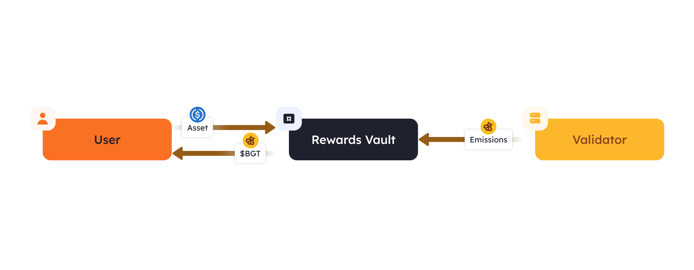
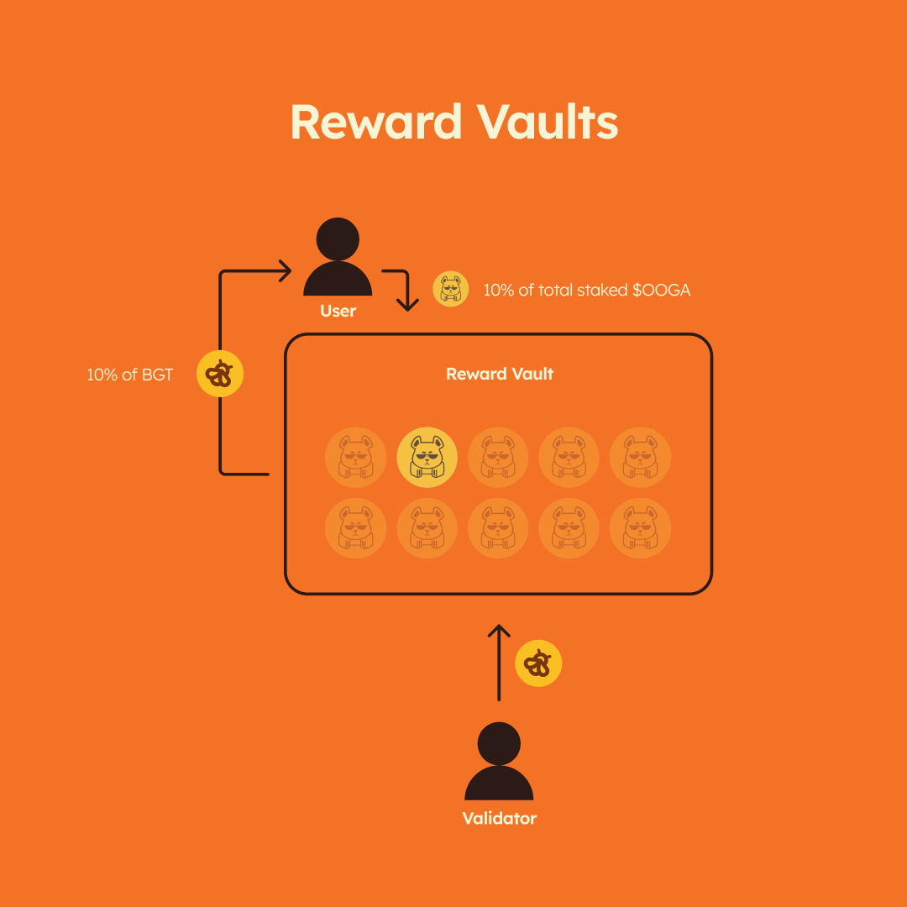
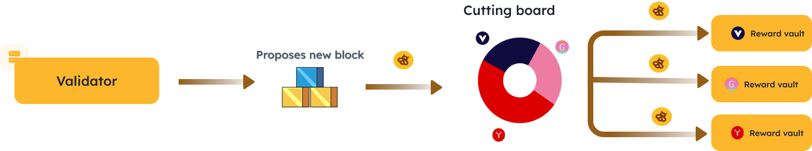

# 奖励金库

奖励金库是一种智能合约，用户可以将符合流动性证明PoL要求的资产质押到奖励金库，以获得`$BGT`奖励。奖励金库是所有用户赚取`$BGT`的唯一途径，因此它具有控制进入PoL生态系统的重要功能。

奖励金库是基础设施的关键部分，它允许协议利用PoL，使协议团队能够激励用户的行为以换取`$BGT`。一个协议可以有多个金库，每个金库都有各自的PoL合规资产。例如，BEX可以有多个赚取`$BGT`的池，每个池都有自己的奖励金库和各自的PoL合规资产。


每个PoL合规资产都有唯一的奖励金库合约。


### 用户交互[​](https://docs.berachain.com/learn/pol/rewardvaults#user-interactions)

#### 在奖励金库中质押

<figure><figcaption></figcaption></figure>

为了获得`$BGT`，用户必须在奖励金库中质押符合PoL标准的资产。部署奖励金库的协议方能够决定用户如何获取符合PoL标准的资产进行质押。协议方可以利用这一点来吸引流动性或刺激链上活动，并以此奖励用户，让用户在自己的协议金库中质押资产。流程如下：

1. 用户从协议获得符合PoL标准的资产，通常称为凭证代币。
2. 用户将符合PoL标准的资产存入相应的金库。
3. 用户将获得该金库赚取的`$BGT`的一部分。

#### 赚取$BGT

<figure><figcaption></figcaption></figure>

用户从奖励金库中获得的`$BGT`奖励数额取决于以下因素：

1. 用户在奖励金库中质押的总资产价值。
2. 奖励金库中发放的`$BGT`奖励份额。

在奖励金库中质押资产后，用户可以随时领取奖励、增加存款或提取资产。

奖励金库中的`$BGT`挖矿类似于常见的DeFi，为普通用户提供了较低的交互门槛。

### 奖励金库中的$BGT来源

<figure><figcaption></figcaption></figure>

验证者将其出块奖励的一部分`$BGT`资产存入他们选择的特定金库中。

要了解验证者为何选择将`$BGT`存入特定金库而不是其他金库，请参阅[PoL](../introduction/what-is-proof-of-liquidity.md)中的激励措施，其中讨论了协议如何通过经济激励来影响验证者的行为。

### 创建新的奖励金库[​](https://docs.berachain.com/learn/pol/rewardvaults#creation-of-new-reward-vaults)

新的奖励金库可以无需许可的创建，但必须通过奖励金库白名单流程，该流程由`$BGT`治理机构执行，以便协议有资格从验证者处获得`$BGT`。开发者或协议方可以提交提案，为符合PoL标准的资产申请新的奖励金库白名单。如果提案通过，则将该金库合约地址添加到验证者`$BGT`存放白名单金库列表中。

你可以在此处了解[奖励金库白名单](../governance/reward-vault-whitelisting.md)流程。
