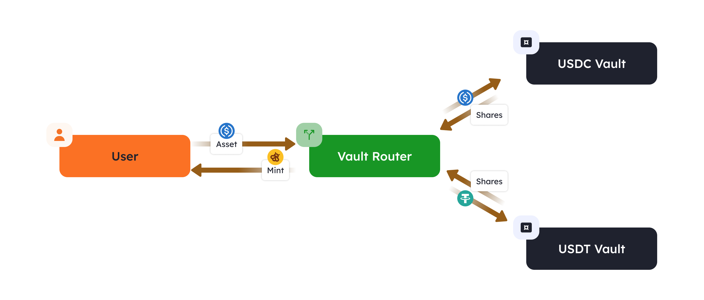

# $HONEY

`$HONEY`代币合约：[0x0E4aaF1351de4c0264C5c7056Ef3777b41BD8e03](https://bartio.beratrail.io/address/0x0E4aaF1351de4c0264C5c7056Ef3777b41BD8e03)

在价格激烈波动的加密资产交易中，稳定性是交易资产的必备属性。`$HONEY`是Berachain的稳定币，旨在为Berachain生态内外提供稳定可靠的交易媒介。`$HONEY`的汇率目标是锚定 1 美元。

### 什么是$HONEY[​](https://docs.berachain.com/learn/pol/tokens/honey#what-is-honey)

`$HONEY`是一种完全抵押稳定币（提供1:1抵押品价值)，与美元软锚定。`$HONEY`支持各种加密货币作为抵押品进行铸造，支持多种抵押品能增强`$HONEY`经济模型的稳定性和弹性。

### 如何获得$HONEY[​](https://docs.berachain.com/learn/pol/tokens/honey#how-to-get-honey)

用户可通过将列入白名单的抵押品资产存入金库铸造`$HONEY`。符合`$HONEY`抵押品条件的不同资产存储在不同的金库合约中。`$HONEY`的铸造率可由`$BGT`治理机构针对每种不同的抵押品性质进行设置。

此外，用户可以通过在[Bex](../../native-dapps/bex.md)上交易其他资产来兑换`$HONEY`。

### 哪些资产可以铸造$HONEY[​](https://docs.berachain.com/learn/pol/tokens/honey#what-determines-which-assets-collateralize-honey)

`$BGT`治理机构决定了哪些资产可以用来铸造`$HONEY`。

### 如何使用$HONEY[​](https://docs.berachain.com/learn/pol/tokens/honey#how-is-honey-used)

`$HONEY`与其他稳定币的用途相似，例如用于支付/汇款以及对冲市场波动。不同的是，`$HONEY`在Berachain生态中有许多独特的用例，包括：

#### Bend：供应[​](https://docs.berachain.com/learn/pol/tokens/honey#lending-bend)

在[Bend](../../native-dapps/bend.md)使用`$HONEY`，用户向Bend协议的`$HONEY`流动性池中供应资产，赚取收益。

对于供应`$HONEY`的用户，将获得一个与`$HONEY`等值的代币[`$aHONEY`](https://docs.bend.berachain.com/learn/lending-protocol/tokens#atokens)，作为存款凭证。

`$HONEY`是Bend接受的唯一可以赚取收益的资产。

#### Bend：借贷[​](https://docs.berachain.com/learn/pol/tokens/honey#borrowing-bend)

Bend还使用`$HONEY`作为基础代币，用户可以存入其他资产作为抵押进行借贷。

#### Berps：永续合约[​](https://docs.berachain.com/learn/pol/tokens/honey#perpetual-futures-berps)

[Berps](../../native-dapps/berps.md)使用`$HONEY`作为抵押、支付和存款等所有交易的基础代币。例如，用户要在ETH上创建杠杆看多头寸，首先他们必须存入适当数量的`$HONEY`。

此外，`$HONEY`持有者可以通过在`$bHONEY`金库中提供流动性，赚取被动收益。`$bHONEY`金库的存款人可以赚取Berps的交易费用，并成为交易者头寸的对手方。例如，如果交易者被清算，该头寸的`$HONEY`抵押品将分配给`$bHONEY`金库中的存款人。

### 铸造$HONEY 

`$HONEY`铸造流程示例：

<figure><figcaption></figcaption></figure>

#### $HONEY金库[​](https://docs.berachain.com/learn/pol/tokens/honey#honey-vaults)

`$HONEY` 通过将合规抵押品存入名为`$HONEY`的专用合约来铸造。每个金库都对应特定的抵押品种类，并具有各自的铸造率和赎回率。

上方示例中，用户存入`$USDC`来铸造`$HONEY`，只有`$USDC`金库与之交互，而`$USDT`金库则不会。

#### 金库路由[​](https://docs.berachain.com/learn/pol/tokens/honey#vault-router)

`$HONEY`铸造的核心组件是金库路由（Vault Router）合约。该合约作为中心枢纽，连接所有`$HONEY`金库，并负责铸造新的`$HONEY`稳定币。

上方示例中，用户的存款通过Vault Router合约被路由到相应金库。Vault Router合约保障金库铸造的`$HONEY`稳定币与用户存入资产对应，然后向用户铸造`$HONEY`代币。

#### 铸造费用[​](https://docs.berachain.com/learn/pol/tokens/honey#fees)

`$HONEY`铸造和赎回中收取的用户费用将分配给`$BGT`持有人，费用由每个金库的铸造率和赎回率决定。例如，如果`$USDC`金库的铸造率为0.995（1`$USDC`兑换0.995`$HONEY`），则每铸造1`$USDC`，收取0.005或0.5%的费用。

### 铸造示例

#### 参数设置：

* 用户希望铸造价值1000`$USDC`的`$HONEY`稳定币
* `$USDC`的铸造率设置为0.995，即99.5%

#### 铸造流程：

1. 用户将1000`$USDC`存入Vault Router合约
2. Vault Router将1000`$USDC`转入`$USDC`金库，并收到1000份铸造凭证
3. Vault Router计算要铸造的`$HONEY`数量：

* 要铸造的`$HONEY`数量=铸造凭证数量×铸造率
* 即，要铸造的`$HONEY`=1000×0.995=995`$HONEY`

4. Vault Router向用户地址铸造995 `$HONEY`
5. Vault Router计算并分发铸造费用：

* 费用数额=铸造凭证数量-铸造的`$HONEY`数量
* 即，费用数额=1000-995=5
* Vault Router将这5个铸造凭证分发给`$BGT`持有人。
