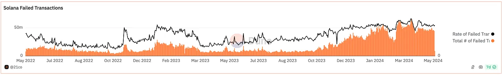
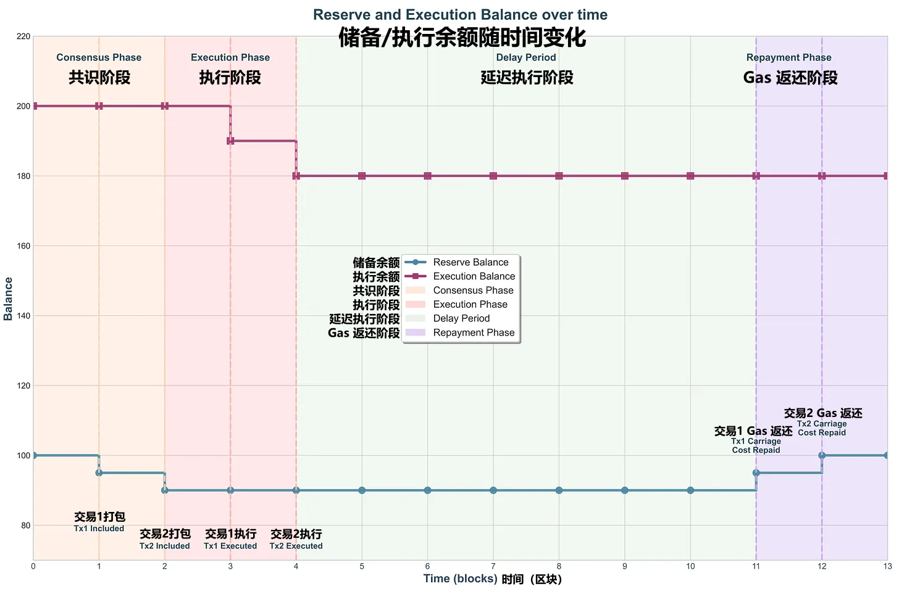

# 释放 Monad 的潜力：区块产出经济学的关键作用

## 介绍 aPriori 

在这篇研究文章中，我们将深入探讨区块产出经济学的原理，以及在区块产出垄断者存在的情况下，区块空间拍卖是如何不可避免的。我们将从激励工程学的角度探讨区块产出经济学，强调 gas 和 MEV 是任何核心协议团队为实现收益和效率最大化而必须解决的关键设计要素。 然后，我们将系统地讨论 aPriori 的区块空间拍卖如何最大限度地减少 MEV 引发的垃圾交易，通过有序和可预测地执行用户的预期操作，促成更直观、更安全的用户体验。

最后，我们将展示 aPriori 等区块空间拍卖协议是如何通过以下方式增强 Monad 的区块产出经济：

* 减少垃圾交易。
* 通过确保区块生产者与区块链网络目标保持一致，从而实现 “用户-区块-生产者” 互利互惠，实现收益最大化。

为了提供全面、公正的分析，我们将使用两个博弈论模型来探讨这些益处：一个是我们研究团队开发的模型，另一个是[ Roughgarden 等人开发的模型](https://eprint.iacr.org/2024/331) 。

## 观点摘要 

### 主要观点和结论 

1. **需要建立一个强大的区块产出经济体**：Monad 的网络系统必须由健康、公平、透明的区块产出设计作为补充。强有力的激励调整将提升用户体验，并进一步增强 Monad 的可靠性。
2. **区块空间拍卖**：由于区块空间的有限性，以及区块生产者对排序的垄断性权力，区块空间拍卖是必要的。从激励设计的角度来看，gas 是核心协议团队调整激励并最大化全局利益的关键决策杠杆。
3. **垃圾交易最小化**：虽然 Monad 的传输成本设计本身可以阻止垃圾交易，但 aPriori 的拍卖旨在最小化 MEV 引起的垃圾交易。它通过从根本上改变 MEV 搜索者的主导策略，将策略包含概率与出价联系起来，而不是鼓励垃圾交易。
4. [**激励相容性**](https://zh.wikipedia.org/wiki/%E6%BF%80%E5%8B%B5%E7%9B%B8%E5%AE%B9)：在后 MEV 时代，任何单独的竞价机制设计都无法完全优化用户体验。要实现激励相容性，就必须采用 aPriori 范式的拍卖。这种拍卖方式确保与 MEV 相关的区块空间的价格是基于经济价值，而不是区块生产者的私人估算。

## 优化区块空间拍卖的激励措施

### 每个时隙 (Slot) 对应一个区块生产者 ⇒ 区块空间拍卖 

我们假设，对于任何给定的 [Slot](https://ethereum.org/zh/glossary/#slot)，都有一个区块生产者，对区块排序拥有垄断权力，该区块生产者唯一决定交易的打包和排序，我们将在未来的博文中探讨多个并发领导人设置 ([Solana. 2024](https://docs.google.com/document/d/1zSkhW\_Urp2RbTp\_hKGCefc8o895eCczm5fS1RqzTVVE/edit#heading=h.73njnkwdob7a)) 中的拍卖。鉴于每个 Slot 的区块空间有限，区块生产者必须分配这种稀缺资源，每次对区块排序时，都必须有效地进行区块空间拍卖。

### 游戏设置：拍卖参与者 

我们将使用博弈论模型 ([Roughgarden 等人. 2024)](https://eprint.iacr.org/2024/331) 来更好地表述区块空间拍卖问题。首先，我们将区块定义为区块生产者提出的交易列表 (Txs) 的有效打包。如果一个区块遵守协议的约束（例如，最大区块大小），则认为该区块是有效的。

接下来，我们将用户定义为向区块链提交一组交易 (Txs) 的个人或实体。对于每笔交易 `Tx t` ，用户对于将其打包进提议区块中的估值设定为非负值 `v_{t, gross}`。该估值通过交易支付规则函数 `p` 进一步调整。值得注意的是，当交易被打包但随后被撤销时，成本通常会降低。用户对交易 `Tx t` 的估值函数为:

$$
v_{t,net} = \begin{cases} v_{t,gross} - p & \text{if \( t \) included} \\ 0 & \text{else} \end{cases} \ \ \ \ \ \ \ (1)
$$

然后，我们将区块生产者定义为确定区块排序最终性的利益相关者 ([dba, 2024](https://dba.xyz/were-all-building-the-same-thing/))。对于任何给定的区块，区块生产者从非空有效 `区块集合 B` 中选择一个 `区块 B`，该集合称为区块集。我们假设区块生产者拥有最大的有效 `区块集 B`，其中可能包括：

* 来自公共内存池 (如果有的话)、钱包、交易机器人、订单流等渠道的交易。
* 区块生产者自己的私人交易，包括 MEV 策略交易或由其他用户的交易所创建的交易包 (Bundles)。

我们还为区块生产者提供了一个**个人效益函数**，将区块生产者的盈利估算建模为：

$$
v_{BP}(B) + \text{net fee earned}
$$

其中，`v_{BP}(B)` 是区块生产者对给定区块 `B` 的个人收益估算。

这种估算可以还采用多种形式，例如 additive 运算或者 quasi-linear 运算，例如：

$$
\sum_{t \in B}\mu_t \text{}
$$

对区块 `B` 中的所有交易 `t` 求和，可能反映了区块生产者试图从不同 DEX 的交易中构建原子套利。

### 区块链网络的全局利益 

利益最大化原则要求将区块空间等稀缺资源分配给游戏中的所有参与者，以实现总效益的最大化。为简单起见，我们假设参与者包括：

* 用户（包括 MEV 搜索者、钱包、dapp 中的用户等）。
* 区块生产者。
* 代币持有者。

我们进一步阐述了以下两个假设：

**假设 1：**对于所有涉及的参与者群组，他们都有 quasi-linear utility 函数。

**假设 2：**参与者支付的 gas 将在不同的参与者群组之间转移。例如，在 EIP-1599 中，我们可以将矿工费用支付视为从用户到区块生产者的转移，将基本费用销毁视为从区块生产者到代币持有者的转移。

我们现在可以将**在任何特定区块上估算出的全局交易费用函数**表达为：

$$
W(B) := v_{BP}(B) + \sum_{t \in B}v_t \ \ \ \ \ \ \ (2)
$$

其中 `v_{BP}(B)` 是区块生产者对输入区块的私人估算，`v_t` 是用户对提交的交易 `Tx t` 的交易费用估算。

### 关键拍卖组件 1：Gas 

从激励设计的角度来看，考虑到区块生产者对区块 `B` 的排序拥有垄断权，核心协议团队的目标是最大化 `W(B)`。通常，核心协议团队会开发 gas 费用机制，或者更正式地说，交易费用机制，该机制作为其操作码的一部分被硬编码到协议规范中。该机制旨在指导参与者，尤其是区块生产者，如何构建区块。

我们将交易费用机制定义为以下两个规则：

1. **Gas 支付规则**

$$
p_t(B, \vec{b})
$$

上述函数定义，在所有交易的给定 gas 出价为 `\vec{b}` 的条件下，交易创建者向区块生产者支付区块 `B` 中每笔交易 `t` 的 gas 费用，以换取将交易 `t` 打包进区块 `B`。

* 例如，对于最高价拍卖和 EIP-1599，gas 支付规则为：

$$
p_t(B, \vec{b}) = b_t \ \forall t \in B
$$

2. **Gas 销毁规则**

$$
q(B, \vec{b})
$$

上述函数定义，在所有交易的给定 gas 出价为 `vec{b}` 的条件下，`B` 区块需要销毁的非零费用金额。

* 例如，对于最高价拍卖：

$$
q(B, \vec{b}) = 0 \ \ \forall t \in B
$$

* 例如，对于 EIP-1599：

$$
q(B, \vec{b}) = \sum_{t \in B}r \times s_t
$$

其中，`s_t` 是 `t` 的公开已知的 gas 数量限额，`r` 是基础费用参数，`s_t` 和 `r` 共同定义了最低费用：`r` × `s_t` 。

一旦确定了 gas 或交易费用机制，区块生产者的效益函数就会更新，以纳入 gas 支付规则和 gas 销毁规则。任一给定区块 `B` 的区块生产者的效益函数定义为：

$$
u_{BP}(B) := v_{BP}(B) + \sum_{t \in B}p_t(B, \vec{b}) - q(B, \vec{b}) \ \ \ \ \ \ \ \ (3)
$$

这里要强调以下几点：


鉴于区块生产者可以自定义区块估算函数 `v_{BP}(B)`，上文的交易费用机制 ( gas 支付规则 + gas 销毁规则) 可以起到**决策功能，**核心协议团队可以通过该功能控制区块生产者，从而潜移默化地影响其构建区块，以实现特定协议目标 (例如用户利益最大化、全局效益最大化、激励相容性等)。

细心的读者可能会想：如果 gas 或交易费用机制是区块生产者平衡其个人费用收益估算与协议激励结构的杠杆，那么它的效果如何？如果仅凭 gas 就能实现激励相容性等理想的网络属性，为什么还要引入额外的拍卖机制？我们很快就会讨论 “gas knob” 的有效性，但首先，让我们研究另一个关键的设计因素：MEV 和 MEV 导致的垃圾交易。


### 关键拍卖组件 2：MEV 和 MEV 导致的垃圾交易 

众所周知，经验表明，MEV 已被证明是影响区块产出经济的最关键设计因素。我们从 [Chrous One 的研究](https://uploads-ssl.webflow.com/63fdf8c863bcf0c02efdffbc/6453962e0884407fba666e22\_Breaking%20Bots.pdf)中总结了一些未经监管的原始 MEV 活动产生的主要[负外部效应](https://baike.baidu.com/item/%E8%B4%9F%E5%A4%96%E9%83%A8%E6%95%88%E5%BA%94/1419146)。

下表总结了 Ethereum 和 Solana 上恶意的 MEV 活动带来的负外部效应：

<table><thead><tr><th width="126">区块链网络</th><th width="134">负外部效应</th><th>问题描述</th></tr></thead><tbody><tr><td><strong>Ethereum</strong></td><td>交易成本增加</td><td>MEV 搜索者参与优先 gas 拍卖 (PGA)，以捕捉 MEV 机会，从而大幅提高了所有交易的 gas 价格。</td></tr><tr><td><strong>Ethereum</strong></td><td>区块空间浪费</td><td>MEV 搜索者的失败交易会占用区块空间，降低区块链的整体效率。</td></tr><tr><td><strong>Ethereum</strong></td><td>抢先交易</td><td>公共内存池允许 MEV 搜索者抢跑攻击普通用户的交易，恶意利用公开可见的未确定交易。</td></tr><tr><td><strong>Solana</strong></td><td>网络垃圾交易</td><td>MEV 搜索者向网络发送重复交易，以使其交易优先执行，从而导致网络拥堵和性能低下问题。</td></tr><tr><td><strong>Solana</strong></td><td>资源浪费</td><td>失败的交易会浪费计算单元和网络带宽，Solana 上约有30%的失败交易，主要原因是 MEV 活动。</td></tr></tbody></table>

正如 Solana 上的 Jito 和 Ethereum 上的 Flashbots 所验证的那样，以可靠和可持续的方式解决 MEV 问题，一直是核心区块链协议迭代的主要路径（[aPriori Research. 2024](https://0xapr.substack.com/p/mev-landscape-in-the-parallel-execution-era)）。

<figure><figcaption>
图 1：<a href="https://dune.com/queries/3537204/5951285">Dune 仪表盘</a> ，该仪表盘说明了 Solana 上的大多数垃圾交易活动和失败交易可能是由 MEV 引起的。
</figcaption></figure>

## aPriori 的拍卖机制：减少 MEV 垃圾交易

### 机制介绍和背景阐述 

在本节中，我们将深入探讨 MEV 导致的垃圾交易问题，首先讨论 Monad 的 gas 设计对防止此类垃圾交易活动发生的可靠性。然后，我们将提供一个博弈论模型，以说明在没有结构化竞价机制的情况下，MEV 搜索者发送垃圾交易的基本动机。此外，我们将更新博弈论模型，以说明实施类似 aPriori 的拍卖机制可以从根本上改变 MEV 搜索者行为，并阐述其在减少垃圾交易方面的有效性。

### Monad 对 DDoS [攻击载体](https://zh.wikipedia.org/wiki/%E6%94%BB%E6%93%8A%E5%AA%92%E4%BB%8B)的防御 

延迟执行会引入潜在的 DDoS 攻击载体，因为无法访问最新网络状态的共识节点，有可能打包零 gas 余额账户创建的交易。

为了解决这个问题，Monad 引入了[**传输成本**和**储备余额**](https://docszh.gitbook.io/monad/technical-discussion/consensus/carriage-cost-and-reserve-balance)的概念。这些机制有效地为 “待确认” 交易提供了账户 gas 估算。当交易包含在区块中时，**传输成本**在共识期间从**储备余额**中扣除，然后在执行时从**执行余额**中扣除。最后，交易成本将在延迟期后退还回预留余额。这种设计确保节点可以检查最新的 gas 支出，即使在达成共识时没有完全的状态访问权限。

<figure><figcaption>
图 2：Monad 的交易 Gas 成本模型：整个交易生命周期中的储备余额和执行余额
</figcaption></figure>

虽然**传输成本**和**储备余额**主要侧重于降低用户（对于验证者）过度使用 gas 的可能性，但我们将展示类似 aPriori 的拍卖机制如何从**结构上改变 MEV 搜索者的主要竞价策略**，从而使 Monad 更能抵御 MEV 导致的垃圾交易。

在本节的剩余部分，我们将探讨两种场景和相应的博弈论模型：一种没有类似 aPriori 的拍卖机制，另一种采用了 aPriori 的拍卖机制。这些模型通过修改 MEV 搜索者的主要策略设置，突出了类似 aPriori 的拍卖机制对减少垃圾交易的积极影响。

### 场景一：没有区块空间拍卖机制 

#### 场景一的建模假设

首先，让我们探讨一下为什么 MEV 搜索者会向领导人节点发送垃圾交易或发送重复的交易。 MEV 搜索者的目的是将他们的套利交易 bundle 或 Tx 打包进区块，最好是有优先级的。如果他们注意到区块打包概率和他们发送的交易数量之间存在正相关关系，受套利激励，他们就会发送大量垃圾交易。随着 MEV 搜索者的恶意竞争，会产生恶性循环，即越来越多的套利者被迫发送更多的垃圾交易。这种正相关关系通常源于底层节点设计。

在 Solana 1.18 版本之前的客户端架构中，其多线程执行模型中缺乏全局调度，导致交易排序不确定。这无意中鼓励了垃圾交易发送，垃圾交易使区块链更加活跃，提高了区块链网络交易量 [(aPriori,2024](https://0xapr.substack.com/p/mev-landscape-in-the-parallel-execution-era))，随机地将区块打包量和链上交易量与垃圾交易联系起来。

我们现在可以将经验观察结果归纳为一套实效且通用的建模假设：

1. **区块打包概率：** MEV 搜索者的交易被打包进区块的可能性随着他们发送的交易数量而增加，设为参数 `κ` 。
2. **交易成本：**交易成功的成本包括实际的 gas 使用量和价格，而交易失败会产生失败费用。
3. **传输成本：**由于传输成本是可退还的预付金，我们假设 MEV 搜索者始终有足够的 gas 余额，因此不会影响他们的收益。

#### 场景一的模型设置

我们定义以下符号：

* `n_i` 是 MEV 搜索者 `S_i` 发送的重复套利交易 Tx 或 bundle 的数量。
* `N` 是所有 MEV 搜索者发送的套利交易 Tx 或 bundle 的总数量，其中：

$$
N = \sum_{j = 1}^{n}{n_j}
$$

* `R` 是打包并执行套利交易 Tx 或 bundle 的奖励。
* `p_i` 是至少有一笔来自 `S_i` 的交易被区块打包的概率，它与 `n_i` _正相关，_并通过参数 `κ` 调整。
* `g_i` 是 `S_i` 发送的套利交易的实际 gas 数量。
* `ϕ_i` 是 `S_i` 发送的套利交易的每单位 gas 的实际价格。
* `δ_i` 是失败套利交易产生的成本，每单位 gas 的失败交易价格。

然后，我们可以得出以下结论：至少有一笔来自 `S_i` 的交易被区块打包的概率 `p_i` ，由参数 `κ` 调整，可以建模为：

$$
p_i = \kappa \frac{n_i}{N} \ \ \ \ \ \ \ \ \ \ \ \ (4)
$$

#### MEV 搜索者的盈亏函数

我们可以将 MEV 搜索者的盈亏函数建模为向领导人节点发送垃圾交易的预期盈亏，将其分为两种情况：

1. **至少有一笔套利交易被区块打包：**

* 该事件发生的概率为 `p_i` 。
* 已实现的盈亏为：

$$
R - \phi_i g_i - (n_i-1) g_i \delta_i
$$

即套利交易获利减去一笔成功套利交易的成本和 `n_i` - 1 笔失败交易的成本。

2. **所有发送的套利交易均被撤回：**

* 此事件发生的概率为 1 - `p_i` 。
* 已实现的盈亏为：`n_i` × `g_i` × `δ_i` × －1，因为所有发送的套利交易都被撤回了。

#### MEV 搜索者的主导套利策略

综上所述，我们得出预期的盈亏为：

$$
\mathbb{E}[\pi_i] = p_i(R-\phi_ig_i-(n_i-1)g_i\delta_i) + (1-p_i)(-n_ig_i\delta_i) \ \ \ \ \ \ (5)
$$

将 `p_i` = `κ` × `n_i` ÷ `N` 代入方程式，得到：

$$
\mathbb{E}[\pi_i] = \kappa \frac{n_i}{N}(R-g_i\phi_i-(n_i-1)g_i\delta_i) - (1-\kappa \frac{n_i}{N})(n_ig_i\delta_i) \ \ \ \ \ \ (6)
$$

为了找到 MEV 搜索者的主导套利策略，我们通过一阶条件最大化 `{E}[π_i]` ：

$$
\frac{\partial\mathbb{E}[\pi_i]}{\partial n_i}= \kappa \frac{R}{N} - \kappa \frac{g_i(\phi_i+\delta_i)}{N} - g_i \delta_i = 0 \ \ \ \ \ \ \ \ (7)
$$

假设所有 MEV 搜索者发送的交易数量相同，则形成对称的[纳什均衡](https://zh.wikipedia.org/wiki/%E7%BA%B3%E4%BB%80%E5%9D%87%E8%A1%A1)。

$$
n_i = n \ \ \forall 1 \leq i \leq N
$$

我们将 `N` = `n^2`。代入一阶条件，得到：

$$
\kappa R - \kappa g_i(\phi_i + \delta_i) - g_i \delta_i n^2 = 0 \ \ \ \ \ \ \ \ (8)
$$

求解这个二次方程，我们发现：

$$
n = \sqrt{\frac{\kappa(R - g_i \phi_i - g_i \delta_i)}{g_i \delta_i}} \ \ \ \ \ \ \ (9)
$$

在没有区块空间拍卖的情况下，发送垃圾交易的均衡数量拥有封闭式解决方案：

$$
n = \sqrt{\frac{\kappa(R - g_i \phi_i - g_i \delta_i)}{g_i \delta_i}} = \sqrt{\kappa \cdot (\frac{R}{\gamma g_i \phi_i} - \frac{1+\gamma}{\gamma})}
$$

在这里，我们将 `n` 设定为 `g_i`、`φ_i` 和 `(0,1)` 中 `δ_i` ÷ `φ_i` = `γ` 的函数。

[不失一般性](https://zh.wikipedia.org/wiki/%E4%B8%8D%E5%A4%B1%E4%B8%80%E8%88%AC%E6%80%A7)，我们假设系数 `κ` = 0.5，MEV 套利回报 `R` = 0.1 eth。此外，我们选择两个实验交易撤回系数 (0.9 和 0.3) 来表示交易撤回成本与预留 gas 成本之差。

结果表明，在均衡条件下，以垃圾交易数量来衡量垃圾交易活动与 gas 价格和 gas 使用量都表现出[超线性](https://baike.baidu.com/item/%E8%B6%85%E7%BA%BF%E6%80%A7/17047500)延展关系。值得注意的是，与 gas 使用量相比，gas 价格的这种超线性关系更为明显。

<figure><figcaption>
图 3：在无区块空间拍卖机制的情况下，最佳垃圾交易的表现特征
</figcaption></figure>

#### 对区块链的影响

假设由于验证者客户端设计中的随机性，导致 MEV 搜索者的交易打包成功率与垃圾交易发送数量呈正相关，MEV 搜索者的主要套利策略是用 `n` 个重复的相同策略交易副本，向领导人节点发送垃圾交易。重复交易的数量 `n` 随着 MEV 套利策略盈亏 ( `R` - `g_i` × `φ_i` - `g_i` × `δ_i` ) 的平方根增长，通过 ( `g_i` × `δ_i` ) 标准化并由参数 `κ` 延展。这表明，随着 MEV 套利策略收入 `R` 相对于 gas 成本的增长，MEV 搜索者会非常积极地发送大量且重复的垃圾交易。简化的效益函数没有考虑的另一个状态是：由于节点的性质，垃圾交易也可能减少了竞争对手交易被打包的机会。这意味着 `n_MEV 搜索者` 实际上成为了其他 MEV 搜索者的交易打包概率 `Pi` 函数中的负值。这种状态意味着 MEV 搜索者对垃圾交易的积极性可能更受套利收益 `R` 的影响，甚至比上述简化假设预测模型描述的更敏感。

### 场景二：采用区块空间拍卖机制

#### 场景二的建模假设

回想一下，MEV 搜索者将尽其所能提高他们的交易被打包概率 `p_i` 。在无区块空间拍卖的情况下，如果他们看到 `p_i` 与他们发送的重复交易数量之间存在正相关关系，他们就会被激励发送垃圾交易。

在类似 PBS ([区块提议者-构建者分离方案](https://ethereum.org/zh/roadmap/pbs/)) 的拍卖机制下，MEV 搜索者的行为和效益函数发生了显著变化。现在，打包概率由**竞价决定**，而不是向领导人节点发送垃圾交易。为了实用起见，我们将在此处分析 PBS 风格的[最高价拍卖](https://zh.wikipedia.org/wiki/%E7%AC%AC%E4%B8%80%E4%BB%B7%E6%A0%BC%E5%AF%86%E5%B0%81%E6%8B%8D%E5%8D%96)，其中 MEV 搜索者的出价通常略低于其价值，以最大化他们的利益。这是由于最高价拍卖的性质导致的，最高出价者获胜，并支付他们的出价。我们首先阐述以下假设：

1. **出价不透明**：在最高价拍卖中，投标者通常会出低于真实价值的报价 ( 这种做法被称为[竞价隐藏](https://en.wikipedia.org/wiki/Bid\_shading) )，以确保在竞拍成功时获得正收益。
2. **真实价值激励**：与[次价拍卖](https://zh.wikipedia.org/wiki/%E7%B6%AD%E5%85%8B%E9%87%8C%E6%8B%8D%E8%B3%A3)不同，次价拍卖会激励投标者依据真实价值出价，而最高价拍卖需要战略性出价，以求利益最大化。
3. **MEV 搜索者的策略**： MEV 搜索者会确定一个最佳出价，平衡被采用的可能性和出价成本，该出价会略低于真实价值，以考虑竞争和利益最大化。

#### 场景二的模型设置

我们定义以下符号：

* `b_i`：MEV 搜索者 `S_i` 为套利交易策略而设置的出价金额。
* `β`：最高价拍卖中，MEV 搜索者为优化真实出价策略，设置的竞价隐藏系数，其值区间：0 < β < 1 。
* `R` 是打包并执行套利交易 Tx 或 bundle 的奖励。
* `p_i` 是至少有一笔来自 `S_i` 的交易被区块打包的概率。
* `g_i` 是 `S_i` 发送的套利交易的实际 gas 数量。
* `ϕ_i` 是 `S_i` 发送的套利交易的每单位 gas 的实际价格。

#### MEV 搜索者的主导套利策略

我们可以在最高价拍卖设置中，通过以下两种情况来模拟 MEV 搜索者的预期盈亏：

1. **至少有一笔套利交易被区块打包：**

* 为简单起见，我们将打包概率建模为：`p_i` = `b_i` ÷ `B`，其中 `B` 表示确保交易被打包进区块所需的总出价金额。这里的标准化因子可确保所有 MEV 搜索者的打包概率正确汇总。
* 在这种情况下，已实现的盈亏为：`R` - `b_i` - `φ_i` × `g_i` 。

2. **所有发送的套利交易均被撤回：**

* 在这种情况下，概率为：1 - `p_i` 。
* 此情况下盈利为0。

结合上述两种情况，我们可以将预期盈亏表达为：

$$
\mathbb{E}[\pi_i] = \frac{b_i}{B} (R - b_i - ϕ_i g_i) \ \ \ \ \ (10)
$$

为了优化 `b_i` ，我们通过一阶条件将 `b_i` 设置为 0 ：

$$
\frac{\partial{\mathbb{E}[\pi_i]}}{\partial b_i} = \frac{1}{B}(R - b_i - \phi_ig_i) -\frac{b_i}{B} = 0 \\ \\ b_i = \frac{R-\phi_i g_i}{2} \ \ \ \ \ \ \ \ (11)
$$

考虑到竞价隐藏系数区间：0 < `β` < 1 ，我们得出：

$$
b_i = \beta(\frac{R-\phi_ig_i}{2}) \ \ \ \ \ \ \ \ (12)
$$

综上所述，我们得出结论：在最高价拍卖中，MEV 搜索者的主导套利策略会发生变化，出价略低于真实价值，如下所示：

$$
b_i = \beta (\frac{R-\phi_ig_i}{2}).
$$

这种策略性的拍卖方式通过将竞价与交易带来的经济价值挂钩，降低了垃圾交易套利的积极性。

### 两种场景的对比与总结

现在，我们对比总结一下 MEV 引发的垃圾交易：

1. **没有区块空间拍卖机制的情况下：**MEV 搜索者受套利激励，通过重复 `n` 次套利策略来发送垃圾交易到领导人节点，这是由交易被打包概率与 `n` 之间的正相关关系，以及 MEV 套利策略盈亏和 gas 成本驱动的。
2. **采用区块空间拍卖机制的情况下：**在类似 PBS 的最高价拍卖中，MEV 搜索者根据其套利策略的经济价值进行战略性出价，从而提高效率，减少发送垃圾交易。

这两种方案并不互斥。即使采用区块空间拍卖机制，如果区块生产者或领导人节点的客户端架构中存在随机性，则打包概率仍可能取决于拍卖出价和重复交易的数量。加密经济设计人员需要了解的关键点是，MEV 搜索者会想尽一切办法来提高其交易打包概率。因此，为了减少负外部效应，像 aPriori 这样的区块空间拍卖提供商必须与验证者合作，以确保 MEV 搜索者的交易被打包概率主要受真实出价的影响，从而减少其对垃圾交易的滥用。

## 重构激励机制：在 MEV 黑暗森林中用 aPriori 攻克不可能理论

在上一节中，我们将 gas 或交易费用机制确定为核心协议团队的决策工具，以影响区块生产者平衡其个人利益与协议利益。现在，我们深入研究了 [Roughgarden 等人](https://eprint.iacr.org/2024/331)提出的不可能性理论，该理论指出，在博弈论设置下，如果区块生产者始终致力于最大化其个人利益，那么任何复杂的 gas 或交易费用机制都无法优化用户的竞价体验。

### 受区块生产者收益策略影响的用户体验

首先，让我们研究一下，区块生产者如何平衡个人收益和 gas 支出，从而影响用户利益或竞价体验。鉴于区块生产者对他们选择发布的区块拥有单方面控制权，而 gas 或交易费用机制充其量只能作为推荐的优化分配方案。因此，我们可以规定区块生产者采用的实际分配规则_，_该规则兼顾了区块生产者个人收益预期 `v_{BP}` (B) 和 gas 支付机制。

规定_分配规则：_

$$
x(\vec{b}, v_{BP}, \mathcal{B})
$$

作为规范区块生产者的函数，所有交易的给定 gas 出价设为 `\vec{b}` ，区块生产者个人收益预期设为 `v_{BP}` ，区块集设为 `B`，交易被打包函数表达为：

$$
x_t(\vec{b}, v_{BP}, \mathcal{B}) = \begin{cases} 1 \ \ \text{if} \ t \in x(\vec{b}, v_{BP}, \mathcal{B}) \\ 0 \ \ \ \text{otherwise} \end{cases} \ \ \ \ \ \ \ \ \ (13)
$$

我们更新了用户的个人效益函数，以纳入区块生产者的分配：

$$
u_t(b_t) := v_t \times x_t( \vec{b}{t}, v{BP}, \mathcal{B}) - p_t(x_t, \vec{b}) \ \ \ \ \ \ \ \ \ \ (14)
$$

请注意，用户唯一能够直接控制的决策变量是交易时提交的 gas 出价 `b_t` 。

### 激励相容性概念

我们现在可以正式定义**激励相容性**概念**。** 我们的目标是证明，如果交易费用机制设计对区块生产者来说是有利可图的，那么他们就不可能在竞价过程中最大限度地提高用户体验。首先，让我们回顾一下 gas 相关激励相容性的精确定义。

### 对区块生产者友好的 Gas 设计

如果 gas 支付规则 `p` 和 gas 销毁规则 `q` 始终驱使区块生产者形成分配规则 `x`，以最大化其收益，那么我们称之为对区块生产者友好的 gas 设计方案。即，假设任一区块生产者收益预期为 `v_{BP}` ，任一区块集 `B` 任一笔交易的 gas 出价为 `\vec{b}` ，支付规则 `p` 和销毁规则 `q` 始终产生一个分配规则 `x` ，如下：

$$
$x(\vec{b}, v_{BP}, \mathcal{B}) \in argmax_{B \in \mathcal{B}} \{v_{BP}(B) + \sum_{t \in B}p_t(B, \vec{b}) - q(B, \vec{b}) \} \ \ \ \ (15)$
$$

### 对用户友好的 Gas 设计

现在，我们分析另一种情况，看看 gas 设计如何对用户友好。从技术上讲，假设存在一种竞价策略 σ ，那么我们称交易费用机制是[支配性策略激励相容](https://zh.wikipedia.org/wiki/%E6%94%AF%E9%85%8D%E6%80%A7%E7%AD%96%E7%95%A5) (DSIC) 的。即，假设任一区块生产者收益预期为 `v_{BP}` ，任一区块集为 `B` ，任一用户 `i` 的交易为 `t` ，对应的用户 `i` 交易费用预算为 `v_t` ，以及任一其他用户的出价为 `b_{-t}` ，我们得到：

$$
$\sigma(v_t) \ \ \in \ \ argmax_{b_t}\{u_t(b_t)\} \ \ \ \ \ \ \ \ \ (16)
$$

我们可以将公式 (16) 视为最大化用户体验的强大而规范的理论研究，它表示始终存在一个一致的**出价策略**，如果用户根据推荐的策略出价，该策略始终可以最大限度地发挥其效用。此外，最佳出价策略仅取决于用户的个人认知，以及用户的交易费用预算 `v_t`，而不取决于其他因素。请注意，这种出价策略是切实可行的，因为普通用户在提交交易时，只希望根据交易费用预算进行出价，而不用考虑其他因素。

### 不可能性理论

我们现在提出主要的**不可能性理论**：


如果交易费用机制与竞价策略 `σ` 是主导策略激励相容的 (即最大化用户体验)，并且与区块生产者激励相容，则对于所有 `σ` 的支付规则 `p` ≡ 0 。


换句话说，在区块生产者的权力垄断和利益最大化条件下，只有微不足道的 gas 设计才能最大限度地提升用户的竞价体验。

### 讨论和影响

不可能性理论基本上说，鉴于区块生产者总是试图构建能够最大化自身利益的区块，核心协议团队无法仅凭一项不起眼的 gas 设计，就能最大限度地提升普通用户的竞价体验。因此，[Roughgarden](https://eprint.iacr.org/2024/331) 根据**不可能理论**推荐了三种设计方案来克服这些问题，包括：

1. 放弃 “良好的用户体验” 或 “基于用户价值的竞价策略” 的设计目标，至少是主导策略激励相容性所体现的。在某种程度上，这是区块链网络的现状，在其中，区块生产者有足够的动力使网络变得活跃。
2. 放弃 “区块生产者激励相容性”，限制和规范区块生产者行为，通过可信硬件、加密技术补充。
3. 延展交易费用机制 (TFM) 设计空间，其中包括区块空间拍卖或区块生产者竞争，实现区块生产者个人出价透明化。

### 结束语：aPriori 如何提供帮助？

aPriori 正在研究第 3 种方案，即建立一个区块空间拍卖系统，以便将 MEV 相关活动从区块生产者的个人竞价策略中分离出来，与利益相关方共享。具体来说，我们总结了以下好处：

1. **独立于区块生产者竞价策略**

在传统网络环境中，由于没有区块空间拍卖，区块生产者对区块构建过程拥有垄断控制权。他们可以私下评估打包某些交易的价值，通常基于 MEV 的套利机会，选择那些能够最大化自身利益的交易。这种私下评估是不透明的，可能导致网络效率低下和不公平交易，因为区块生产者可能会将自身利益置于网络参与者和网络全局利益之上。

2. **通过竞价透明化区块空间价格**

区块空间拍卖引入了一个竞争性出价过程，MEV 搜索者出价以向区块寻求打包交易包 (bundles) 。通过要求 MEV 搜索者提交出价，网络系统以透明的方式披露了这些交易的真正价值。最高出价反映了 MEV 机会的市场价值，否则将由区块生产者私下评估。

3. **改进用户体验**

竞争性出价通过创建一个更可预测的竞价策略环境，改善了用户交易出价体验。这还降低了不公平操作的可能性，例如基于个人利益的交易抢跑或选择性打包交易。

## 结论

我们的研究首先考察了在没有区块空间拍卖的情况下 MEV 价值提取的状态。我们证明了如果没有拍卖机制，MEV 搜索者就会受到利益激励，进行垃圾交易，从而导致公共悲剧。我们的模型表明，垃圾交易的均衡数量与 gas 价格和 gas 使用量呈超线性关系，特别是当回撤交易成本相对于预存 gas 成本较高时。

这一分析强调了区块链网络中，设计可靠经济机制的迫切需求。为了充分利用 Monad 的技术优势，建立一个可靠、透明且激励相容的区块产出经济至关重要。区块空间拍卖的概念是这一策略的核心，由垄断性的区块生产者分配稀缺资源：区块空间。这种设置将区块空间的分配与区块生产者的自由裁量权联系在一起，并受到公共 gas 竞价和个人价值评估的影响。

鉴于区块生产者拥有个人价值评估，仅凭微不足道的 gas 机制无法优化用户体验。这是因为区块生产者的决策受个人利益激励的影响，因此仅凭 gas 费用设计很难实现全局激励相容的网络。 在此，aPriori 的区块空间拍卖变得至关重要，从根本上改变了 MEV 搜索者的主导策略。 通过将 MEV 搜索者的交易打包概率与拍卖出价联系起来，从而缓解垃圾交易滥用。aPriori 最大限度地减少了 MEV 引起的垃圾交易，促进区块链网络生态系统向更健康、更高效的目标发展。

此外，aPriori 解决了区块生产者垄断权力和个人价值评估带来的挑战。它将 MEV 相关价值从区块生产者拥有自由裁量权的模糊领域转移到透明的拍卖环境中。这种透明度确保了交易价格基于真实的经济价值，而不是受区块生产者私人利益的影响。

从本质上讲，是 Monad 的技术创新奠定了坚实的基础，而 aPriori 的经济机制整合则使 Monad 生态系统更为强大。通过营造公平透明的区块产出环境，aPriori 有助于确保区块生产者的行为符合网络的最佳利益，最终使所有参与者受益。尖端技术与深思熟虑的经济设计之间的协同，将推动 Monad 迈向更具韧性和可扩展性的未来。

## 原文链接

Substack 链接：[Unlocking Monad’s Potential: The Critical Role of Block Production Economics](https://0xapr.substack.com/p/unlocking-monads-potential-the-critical)

作者：Edward Shi 和 [aPriori](https://x.com/aprMEV) 团队，发布时间：2024 年 10 月 2 日

## 参考资料

Franklin, T., Fynn, E., Natale, U., & van Asseldonk, R. (2023). Breaking Bots: MEV on Solana and how to prevent frontrunning, spam attacks, and centralization. Chorus One. Retrieved from [Chorus One Research](https://dune.com/chorus\_one\_research/solana-mev-data)

Roughgarden, Tim, et al. “Transaction Fee Mechanism Design in the Post-MEV World.” 2024.

dba. “We’re All Building the Same Thing.” _dba_, 2024, [https://dba.xyz/were-all-building-the-same-thing/](https://dba.xyz/were-all-building-the-same-thing/). Accessed 13 July 2024.

Helius. “Turbine: Block Propagation on Solana.” _Helius Blog_, 2024, [https://www.helius.dev/blog/turbine-block-propagation-on-solana](https://www.helius.dev/blog/turbine-block-propagation-on-solana). Accessed 13 July 2024.

“IoTeX: Decentralized Verification in DePIN.” IoTeX, 12 May 2023, [https://iotex.io/blog/decentralized-verification-in-depin/](https://iotex.io/blog/decentralized-verification-in-depin/). Accessed 15 July 2024.

Xu, Yang, et al. “Improving Decentralized Performance Incentives with Probabilistic Verification.” arXiv, 31 July 2023, [https://arxiv.org/pdf/2307.16562](https://arxiv.org/pdf/2307.16562). Accessed 15 July 2024.

“Deferred Execution.” Monad, 2024, [https://docs.monad.xyz/technical-discussion/consensus/deferred-execution](https://docs.monad.xyz/technical-discussion/consensus/deferred-execution). Accessed 15 July 2024.

Multiple Concurrent Leaders in Solana. 2024. [https://docs.google.com/document/d/1zSkhW\_Urp2RbTp\_hKGCefc8o895eCczm5fS1RqzTVVE/edit#heading=h.73njnkwdob7a](https://docs.google.com/document/d/1zSkhW\_Urp2RbTp\_hKGCefc8o895eCczm5fS1RqzTVVE/edit#heading=h.73njnkwdob7a). Accessed 15 July 2024.

aPriori Research. “MEV Landscape in the Parallel Execution Era.” Substack, 18 May 2024, [https://0xapr.substack.com/p/mev-landscape-in-the-parallel-execution-era](https://0xapr.substack.com/p/mev-landscape-in-the-parallel-execution-era). Accessed 23 July 2024.

DAIC Capital. “Monad: Exploring the Technical Architecture of Blockchain.” DAIC Capital, 2024, [https://daic.capital/blog/monad-exploring-technical-architecture-blockchain](https://daic.capital/blog/monad-exploring-technical-architecture-blockchain). \

\

