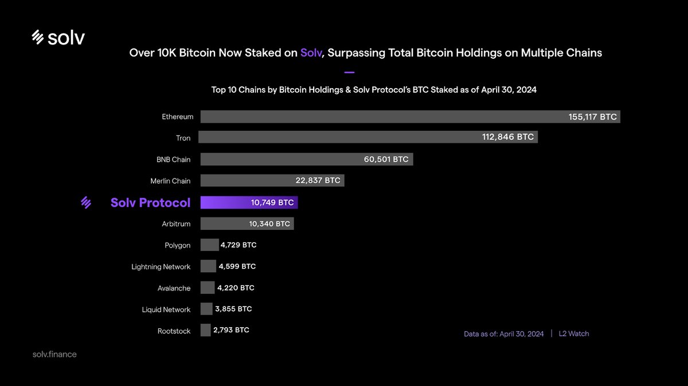
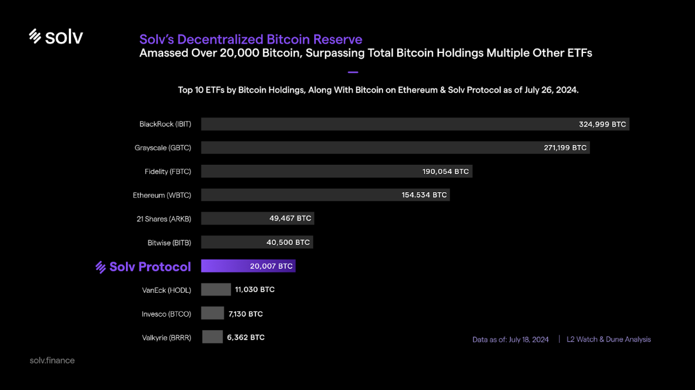

# 比特币生态现状

$BTC占加密货币总市值的50%以上，价值超过1.3万亿美元。

### 价值超万亿美元的$BTC资产处于闲置状态

#### **没有原生收益策略**

与$ETH不同，$ETH受益于蓬勃发展的质押生态，而$BTC没有高质量的原生收益解决方案。

截至至2024年6月13日：

* 约28%的$ETH供应被质押 (33M/120M)
* 约29%的$ETH质押通过Lido实现 (10M/33M)

参考当下$BTC价格，Solv只需要将2.5%的$BTC供应存入Solv金库，就能达到与Lido同等的TVL水平。

#### **DeFi中分散的**$BTC**流动性**

$BTC的流动性分散在Layer 1、ETH Layer 2和BTC Layer 2中。

目前有超过80个协议正在试图扩展到比特币网络，争夺$BTC流动性份额。

Solv协议将自己定义为$BTC的流动性层，已有超过19,000个$BTC被质押在Solv，甚至超过了某些链的链上$BTC存款量。

#### **与DeFi核心协议集成性差**

$ETH及其衍生品和稳定币仍然是DeFi中的首选质押和抵押资产。

Solv协议正在积极拓展与Layer 1/Layer 2链和热门DeFi项目的合作，以整合Solv的$BTC流动性收益代币，为蓬勃发展的BTCFi生态铺平道路。

### 此刻，属于比特币季节！

#### 资本青睐的比特币基础设施

2024年上半年，与$BTC相关的项目共筹集了超过1亿美元的融资，这表明资本对BTCFi的兴趣日益浓厚。

#### 用户青睐的比特币原生资产

比特币的原生资产及DeFi，如BRC-20、Ordinals、Runes等，在投机市场大放异彩，而OP\_CAT则为$BTC的更多效用打开了大门。

#### Solv的解决方案得到市场验证

自$SolvBTC推出以来，不到四个月时间，已超过19,000个比特币被质押在Solv协议，甚至超过了BTC ETF和某些链的链上$BTC存款量。

**与L1 / ETH L2 / BTC L2比较：Solv的$BTC存款量位列第五**

<figure><figcaption></figcaption></figure>

**与BTC** **ETFs / Ethereum比较：Solv的$BTC存款量位列第七**

<figure><figcaption></figcaption></figure>
